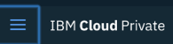

---

copyright:
  years: 2017, 2018
lastupdated: "2018-06-28"

---

{:shortdesc: .shortdesc}
{:new_window: target="_blank"}
{:tip: .tip}
{:pre: .pre}
{:codeblock: .codeblock}
{:screen: .screen}
{:javascript: .ph data-hd-programlang='javascript'}
{:java: .ph data-hd-programlang='java'}
{:python: .ph data-hd-programlang='python'}
{:swift: .ph data-hd-programlang='swift'}

# Using alerts
{: #using-alerts}

You can set up alerts for your {{site.data.keyword.cnc_short}} cluster.

## Installing the alerts dashboard

To install the alerts dashboard for {{site.data.keyword.cnc_short}}, perform the following steps.

 1. Download the Passport Advantage (PPA) file for {{site.data.keyword.cnc_short}}. The file is a zipped tar file with a name similar to `ibm-watson-compare-comply-prod-1.0.0.tar.gz`. The file includes the alerts dashboard template and a `bash` script to render the dashboard from the template.

 1. Uncompress and expand the PPA file:
  ```bash
  $ mkdir ibm-watson-compare-comply-prod-1.0.0 && tar -xvzf ibm-watson-compare-comply-prod-1.0.0.tar.gz -C ibm-watson-compare-comply-prod-1.0.0
  ```
  {: codeblock}

 1. Change to the `charts` directory in the extracted directory:
   ```bash
   $ cd ibm-watson-compare-comply-prod-1.0.0/charts    
   ```

 1. Uncompress and expand the zipped tar file in the `charts` directory:
   ```bash
   $ tar -xvzf ibm-watson-compare-comply-prod-1.0.0.tgz
   ```

 1. Change to the `dashboard` directory. It includes templates for metrics and logging, and a bash script to generate dashboards
from templates.

   ```bash
   $ cd ibm-watson-compare-comply-prod/dashboard

   $ tree
   .
   ├── alerts.json.tpl
   ├── external-process-logging.json.tpl
   ├── frontend-logging.json.tpl
   ├── metrics.json.tpl
   └── render-dashboards.sh

   0 directories, 5 files
   ```

  1. Run the `render-dashboards.sh` script to render the templates. Options for the script include:
  
    -  `-v, --version {chart_version}`: The chart version; for example, `1.0.0`.
    -  `-h, --help`: Print command help and exit.
    -  `-r, --release {release_name}`: The Helm release name.
    -  `-n, --namespace {namespace}`: The namespace of the deployment. The default namespace is `default`.

   ```bash
   $ ./render-dashboards.sh -v 1.0.0 -r my-test-release -n default
   The dashboard JSON files are generated under /Users/{user}/Downloads/ibm-watson-compare-comply-prod-1.0.0/charts/ibm-watson-compare-comply-prod/dashboard.

   $ tree
   .
   ├── alerts.json
   ├── alerts.json.tpl
   ├── external-process-logging.json
   ├── external-process-logging.json.tpl
   ├── frontend-logging.json
   ├── frontend-logging.json.tpl
   ├── metrics.json
   ├── metrics.json.tpl
   └── render-dashboards.sh

   0 directories, 9 files
   ```

## Adding the alert rules

To add the alert rules to the dashboard, perform the following steps.

  1. Log in to your ICP cluster.

  1. From the Menu icon in the upper left-hand corner, select **Configuration -> ConfigMaps**.
       <br />
      

  1. The **ConfigMaps** page opens to display a table of configmaps. In the table, locate the row labeled `alert-rules`. In the **Action** column of the `alert-rules` row, click the menu icon and select **Edit**.
     

  1. Open the `.../ibm-watson-compare-comply-prod-1.0.0/charts/ibm-watson-compare-comply-prod/dashboard/alerts.json` file in a text editor and copy the line that begins with `cnc.rules`.

  1. The **Edit ConfigMap** window opens. In the `data` object, add a comma at the end of the last line of the object, then paste in the `cnc.rules` line you copied in the preceding step. <br />
     

  1. Click **Submit** in the **Edit ConfigMap** window.

## Viewing alert rules

To view the list of alert rules, perform the following steps.

  1. Navigate to the Prometheus dashboard on your IBM Cloud Private cluster. The Prometheus dashboard is located at `https://{ICP_cluster_IP_address}:{ICP_cluster_port}/prometheus`.

  1. Click the **Alerts** tab. The Prometheus dashboard displays a list of all alert rules and the number of active alerts for each. <br />
    

## Adding alert notifications

You can add alert notifications for numerous paging systems, including Slack, PagerDuty, HipChat, email, and others. Prometheus provides support for notifications as documented at the following sites:

 - [Prometheus Alerting Configuration documentation ](https://prometheus.io/docs/alerting/configuration/){: new_window}
 - [Prometheus Notification Examples documentation ](https://prometheus.io/docs/alerting/notification_examples/){: new_window}

To create a notification receiver for {{site.data.keyword.cnc_short}} on IBM Cloud Private, perform the following steps.
{: #create-notification-receiver}

  1. Log in to your ICP cluster.

  1. From the Menu icon in the upper left-hand corner, select **Configuration -> ConfigMaps**. <br />
       <br />
      

  1. The **ConfigMaps** page opens to display a table of configmaps. In the table, locate the row labeled `monitoring-prometheus-alertmanager`. In the **Action** column of the `monitoring-prometheus-alertmanager` row, click the menu icon and select **Edit**.

  1. The **Edit ConfigMap** window opens. In the `data` object, enter the new receiver configurations.
     

  1. Click **Submit** in the **Edit ConfigMap** window.

### Examples

To create a Slack notification, perform the following steps.

  1. Verify that the target Slack channel exists. If it does not, create it. See the [Slack documentation for creating a channel ](https://get.slack.help/hc/en-us/articles/201402297-Create-a-channel){: new_window} for details.

  1. Obtain or create the WebHook for the Slack channel. See the [Slack documentation for WebHooks ](https://get.slack.help/hc/en-us/articles/115005265063-Incoming-WebHooks-for-Slack){: new_window} for details.

  1. Open the `monitoring-prometheus-alertmanager` ConfigMap in the ConfigMap editor as described in [Adding alert notifications ](#create-notification-receiver).

  1. Update the `data` object in the ConfigMap as follows:
    ```
    "data": {
      "alertmanager.yml": "global: \n  slack_api_url: '{WebHook_URL_for_Slack_channel}' \nreceivers: \n  - name: default-receiver \n    slack_configs: \n    - channel: '#{Slack_channel}' \n      send_resolved: true \nroute: \n  receiver: default-receiver \n  routes: \n  - match: \n    severity: critical \n   receiver: default-receiver"
    }
    ```
    {: codeblock}

  1. In the **Edit ConfigMap** window, click **Submit**.

To create a PagerDuty notification, perform the following steps.

  1. Verify that the PagerDuty service exists. If it does not, create it. See the [PagerDuty documentation ](https://v2.developer.pagerduty.com/docs){: new_window} for details.

  1. Get the PagerDuty integration key by adding the Prometheus integration. See the [PagerDuty API documentation ](https://v2.developer.pagerduty.com/docs/events-api){: new_window} for details.

  1. Open the `monitoring-prometheus-alertmanager` ConfigMap in the ConfigMap editor as described in [Adding alert notifications  ](#create-notification-receiver).

  1. Update the `data` object in the ConfigMap as follows:
    ```
    "data": {
      "alertmanager.yml": "global:\nreceivers:\n  - name: default-receiver\n    pagerduty_configs:\n    - service_key: ' {PagerDuty_integration_key}'\nroute:\n  receiver: default-receiver\n  routes:\n  - match:\n      severity: critical\n    receiver: default-receiver"
    }
    ```
    {: codeblock}

  1. In the **Edit ConfigMap** window, click **Submit**.
  
