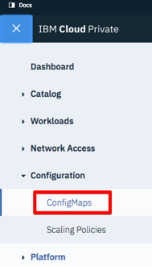
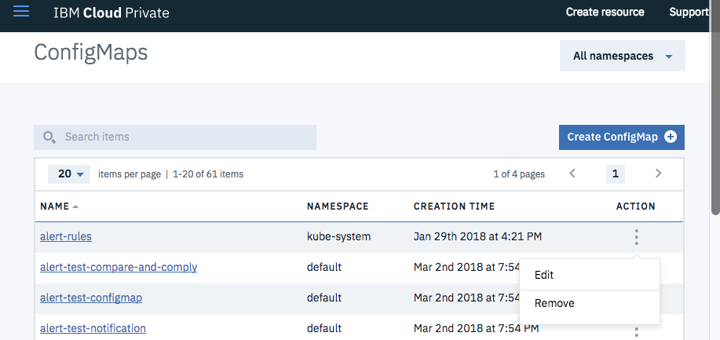
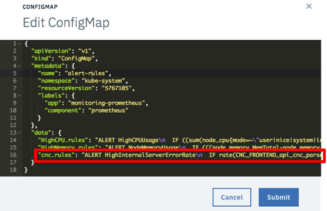
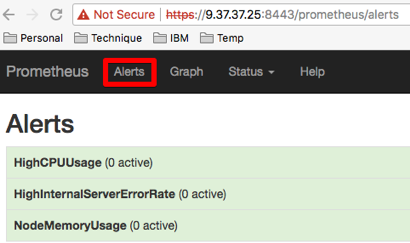
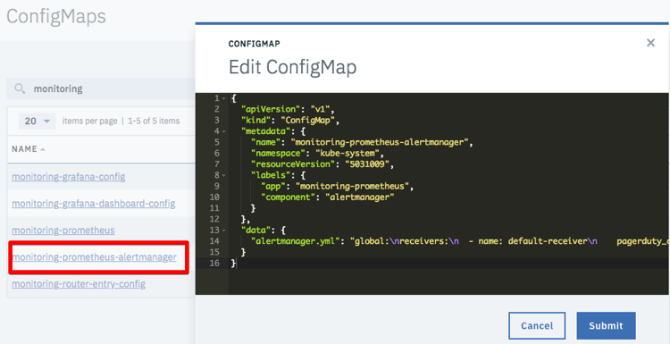

---

copyright:
  years: 2017, 2021
lastupdated: "2021-05-25"

subcollection: compare-and-comply

---

{:shortdesc: .shortdesc}
{:new_window: target="_blank"}
{:tip: .tip}
{:pre: .pre}
{:codeblock: .codeblock}
{:screen: .screen}
{:javascript: .ph data-hd-programlang='javascript'}
{:java: .ph data-hd-programlang='java'}
{:python: .ph data-hd-programlang='python'}
{:swift: .ph data-hd-programlang='swift'}

# Using monitoring alerts
{: #alerts}

You can set up Prometheus alerts for your Compare and Comply instance after you import the alerts dashboard, as described in the following sections.
{: shortdesc}

## Importing the alerts dashboard and adding alert rules
{: #import-alert-dashboards}

To import the alerts dashboard and add alert rules to the dashboard, perform the following steps.

  1. Ensure that you have extracted and generated the alerts dashboards as described in [Step 1: Download, extract, and render the dashboard templates](/docs/compare-and-comply?topic=compare-and-comply-monitor).

  1. Log in to your ICP cluster.

  1. From the Menu icon in the upper left-hand corner, select **Configuration -> ConfigMaps**.
       <br />
      

  1. The **ConfigMaps** page opens to display a table of configmaps. In the table, locate the row labeled `alert-rules`. In the **Action** column of the `alert-rules` row, click the menu icon and select **Edit**.
     

  1. Open the `.../ibm-watson-compare-comply-prod-1.1.4/charts/ibm-watson-compare-comply-prod/dashboard/alerts.json` file in a text editor and copy the line that begins with `cnc.rules`.

  1. The **Edit ConfigMap** window opens. In the `data` object, add a comma at the end of the last line of the object, then paste in the `cnc.rules` line you copied in the preceding step. <br />
     

  1. Click **Submit** in the **Edit ConfigMap** window.

## Viewing alert rules
{: #view-alert-rules}

To view the list of alert rules, perform the following steps.

  1. Navigate to the Prometheus dashboard on your IBM Cloud Private cluster. The Prometheus dashboard is located at `https://{ICP_cluster_IP_address}:{ICP_cluster_port}/prometheus`.

  1. Click the **Alerts** tab. The Prometheus dashboard displays a list of all alert rules and the number of active alerts for each. <br />
    

## Adding alert notifications
{: #add-alert-notifications}

You can add alert notifications for numerous paging systems, including Slack, PagerDuty, HipChat, email, and others. Prometheus provides support for notifications as documented at the following sites:

 - [Prometheus Alerting Configuration documentation ](https://prometheus.io/docs/alerting/configuration/){: new_window}
 - [Prometheus Notification Examples documentation ](https://prometheus.io/docs/alerting/notification_examples/){: new_window}

### Creating a notification receiver
{: #create-notification-receiver}

To create a notification receiver for Compare and Comply on IBM Cloud Private, perform the following steps.

  1. Log in to your ICP cluster.

  1. From the Menu icon in the upper left-hand corner, select **Configuration -> ConfigMaps**. <br />
       <br />
      

  1. The **ConfigMaps** page opens to display a table of configmaps. In the table, locate the row labeled `monitoring-prometheus-alertmanager`. In the **Action** column of the `monitoring-prometheus-alertmanager` row, click the menu icon and select **Edit**.

  1. The **Edit ConfigMap** window opens. In the `data` object, enter the new receiver configurations.
     

  1. Click **Submit** in the **Edit ConfigMap** window.

### Examples
{: #alert-examples}

To create a Slack notification, perform the following steps.

  1. Verify that the target Slack channel exists. If it does not, create it. See the [Slack documentation for creating a channel ](https://get.slack.help/hc/en-us/articles/201402297-Create-a-channel){: new_window} for details.

  1. Obtain or create the WebHook for the Slack channel. See the [Slack documentation for WebHooks ](https://get.slack.help/hc/en-us/articles/115005265063-Incoming-WebHooks-for-Slack){: new_window} for details.

  1. Open the `monitoring-prometheus-alertmanager` ConfigMap in the ConfigMap editor as described in [Adding alert notifications](#create-notification-receiver).

  1. Update the `data` object in the ConfigMap as follows:
    ```
    "data": {
      "alertmanager.yml": "global: \n  slack_api_url: '{WebHook_URL_for_Slack_channel}' \nreceivers: \n  - name: default-receiver \n    slack_configs: \n    - channel: '#{Slack_channel}' \n      send_resolved: true \nroute: \n  receiver: default-receiver \n  routes: \n  - match: \n    severity: critical \n   receiver: default-receiver"
    }
    ```
    {: codeblock}

  1. In the **Edit ConfigMap** window, click **Submit**.

To create a PagerDuty notification, perform the following steps.

  1. Verify that the PagerDuty service exists. If it does not, create it. See the [PagerDuty documentation ](https://v2.developer.pagerduty.com/docs){: new_window} for details.

  1. Get the PagerDuty integration key by adding the Prometheus integration. See the [PagerDuty API documentation ](https://v2.developer.pagerduty.com/docs/events-api){: new_window} for details.

  1. Open the `monitoring-prometheus-alertmanager` ConfigMap in the ConfigMap editor as described in [Adding alert notifications](#create-notification-receiver).

  1. Update the `data` object in the ConfigMap as follows:
    ```
    "data": {
      "alertmanager.yml": "global:\nreceivers:\n  - name: default-receiver\n    pagerduty_configs:\n    - service_key: ' {PagerDuty_integration_key}'\nroute:\n  receiver: default-receiver\n  routes:\n  - match:\n      severity: critical\n    receiver: default-receiver"
    }
    ```
    {: codeblock}

  1. In the **Edit ConfigMap** window, click **Submit**.
