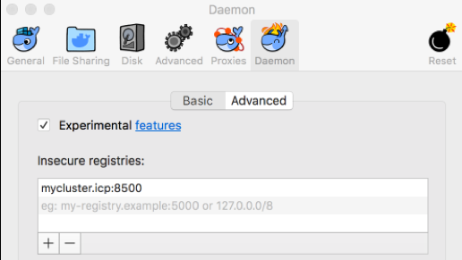

---

copyright:
years: 2018
lastupdated: "2018-08-02"

---

{:shortdesc: .shortdesc}
{:new_window: target="_blank"}
{:tip: .tip}
{:pre: .pre}
{:codeblock: .codeblock}
{:screen: .screen}
{:javascript: .ph data-hd-programlang='javascript'}
{:java: .ph data-hd-programlang='java'}
{:python: .ph data-hd-programlang='python'}
{:swift: .ph data-hd-programlang='swift'}

# Deploying the service
{: #install}

Before you install the IBM Watson Compare and Comply Helm chart as described in the Helm chart's `README.md` file, you might need to perform additional deployment steps. You need to perform these steps only if you are deploying Compare and Comply version 1.0.3 or earlier. These steps do not apply if you are deploying Compare and Comply version 1.0.4 or later.

## Default system values
{: #sys_vals}

These instructions use the following default system values. The values for your system might differ. Check with your IBM Cloud Private administrator.

 - IBM Cloud Private cluster name and port number:
      `mycluster.icp:8500`

 - IBM Cloud Private namespace:
      `default`

## Completing the deployment
{: #deploy}

Perform the following steps to complete the Compare and Comply deployment:

### Step 1: Grant Docker access
{: #step1}

  1. Grant Docker access to the IBM Cloud Private registry.
  
    - If you are running Microsoft Windows or Apple macOS or OS X, perform the following steps:

      1. Click the **Docker** icon.
      
      1. Open the Docker **Preferences** menu.
    
      1. Click the **Daemon** tab.
    
      1. In the **Insecure registries** field, add the value `mycluster.icp:8500` or the value for your IBM Cloud Private installation.

      

    - If you are running Linux, perform the following steps:

      1. Locate the `daemon.json` file. By default, this file is located at `/etc/docker/daemon.json`. If the file does not exist, create it at the default location. Open the file in a text editor and verify or add the following JSON.

      ```
      {
         "insecure-registries": ["mycluster.icp:8500"]
      }
      ```
      
      1. Run the following commands:
      
      ```bash
      systemctl daemon reload
      ```
      {: pre}
      
      ```bash
      systemctl restart docker
      ```
      {: pre} 

### Step 2: Download the IBM Cloud Private and IBM Cloud CLIs
{: #step2}

  1. Download and install the Helm CLI for each version of IBM Cloud Private you are using. See the [IBM Cloud Private documentation ](https://www.ibm.com/support/knowledgecenter/SSBS6K_2.1.0.3/manage_cluster/icp_cli.html){: new_window} for details.
  
  1. Download and install the IBM Cloud CLI. See the [IBM Cloud documentation ](https://console.bluemix.net/docs/cli/reference/bluemix_cli/download_cli.html#download_install){: new_window} for details.
  
  1. Download and install the IBM Cloud CLI `bx` plug-in. See the [IBM Cloud documentation ](https://console.bluemix.net/docs/cli/reference/bluemix_cli/extend_cli.html#plug-ins){: new_window} for details.

### Step 3: Download the package file
{: #step3}

Download the `IBM_WTSN_COMPARE_AN_COMPL_ELEM_CL.tar.gz` package file from [Passport Advantage ](https://www-01.ibm.com/software/passportadvantage/){: new_window} to your local workstation. This file contains the entire Compare and Comply service image.
  
#### Edit the package file if necessary
{: edit-pkg-file}

**Important**: Perform the procedure in this step *only* if the following conditions are true. If either or both conditions are false, proceed to [Step 4](#step4).

 - This step applies only to Compare and Comply version 1.0.3 and earlier. If you are installing Compare and Comply version 1.0.4 or later, do not perform the procedure in this step.

 - You need to follow the procedure in this step only if your IBM Cloud Private cluster is not connected to the external internet. If your IBM Cloud Private cluster has network access to the [Passport Advantage ](https://www-01.ibm.com/software/passportadvantage/){: new_window} site, you can install and deploy Compare and Comply version 1.0.3 without any modifications to the package file.

**Note**: If you perform the procedure in this step, you can experience problems with upgrades and rollbacks of Compare and Comply version 1.0.3. 

  1. In a `bash` shell or similar environment such as Cygwin, extract the `IBM_WTSN_COMPARE_AN_COMPL_ELEM_CL.tar.gz` file:
  
  ```bash
  cd {path_to_file}
  ```
  {: pre}

  ```bash
  tar -xvzf IBM_WTSN_COMPARE_AN_COMPL_ELEM_CL.tar.gz
  ```
  {: pre}

 The extracted file includes a directory named `charts` that contains a file named `ibm-watson-compare-comply-prod-1.0.3.tgz`, which is a compressed version of the Helm chart for Compare and Comply.

  1. Change to the `charts` directory and extract the `ibm-watson-compare-comply-prod-1.0.3.tgz` file:
  
  ```bash
  cd charts
  ```
  {: pre}
 
  ```bash
  tar -xvzf ibm-watson-compare-comply-prod-1.0.3.tgz
  ```
  {: pre}
 
  The extracted file includes a number of directories and files, including a top-level directory named `ibm-watson-compare-comply-prod` that contains a directory named `templates`.

  1. Change to the `ibm-watson-compare-comply-prod/templates` directory:
  
  ```bash
  cd ibm-watson-compare-comply-prod/templates
  ```
  {: pre}
 
  1. Locate the `deployment.yaml` file in the `ibm-watson-compare-comply-prod/templates` directory and open it in a text editor.
 
  1. Edit the `deployment.yaml` file as follows:
  
  **Original**
  
  ```
    – name: {{ .Chart.Name }}
        image: "hyc-icpcontent-docker-local.artifactory.swg-devops.com/cncdev/cnc-frontend:v2.3.12"
        imagePullPolicy: Always
  ```
  {: screen}
  
  **Updated**
  
  ```
    – name: {{ .Chart.Name }}
        image: "mycluster.icp:8500/default/cnc-frontend:v2.3.12"
        imagePullPolicy: Always
  ```
  {: screen}
  
  Save and close the `deployment.yaml` file.

  1. Return to the `charts` directory and repackage the `ibm-watson-compare-comply-prod-1.0.3.tgz` file:
  
    ```bash
    cd ../..
    ```
    {: pre}
  
    ```bash
    tar -cvzf ibm-watson-compare-comply-prod-1.0.3.tgz ibm-watson-compare-comply-prod
    ```
    {: pre}
   
  1. Return to the top-level directory and repackage the `IBM_WTSN_COMPARE_AN_COMPL_ELEM_CL.tar.gz` file:
  
    ```bash
    cd ..
    ```
    {: pre}
 
   ```bash
   tar -cvzf IBM_WTSN_COMPARE_AN_COMPL_ELEM_CL.tar.gz charts images manifest.json manifest.yaml
  ```
  {: pre}
  
  For reference, the `tree` view of the contents of the uncompressed `IBM_WTSN_COMPARE_AN_COMPL_ELEM_CL.tar.gz` file is as follows. Files involved in this procedure are called out with `<-----` in the right-hand column.
 
  ```bash
  cd {path_to_archive_file}
  ```
  {: pre}
   
  ```
  $ tree 
     .
     ├── IBM_WTSN_COMPARE_AN_COMPL_ELEM_CL.tar.gz          <-----
     ├── charts                                            <-----
     │   ├── ibm-watson-compare-comply-prod
     │   │   ├── Chart.yaml
     │   │   ├── LICENSE
     │   │   ├── LICENSES
     │   │   │   └── LICENSE-Product
     │   │   ├── README.md
     │   │   ├── cnc-banner.png
     │   │   ├── dashboard
     │   │   │   ├── alerts.json.tpl
     │   │   │   ├── external-process-logging.json.tpl
     │   │   │   ├── frontend-logging.json.tpl
     │   │   │   ├── metrics.json.tpl
     │   │   │   └── render-dashboards.sh
     │   │   ├── templates                                 <-----
     │   │   │   ├── NOTES.txt
     │   │   │   ├── _helpers.tpl
     │   │   │   ├── _sch-chart-config.tpl
     │   │   │   ├── configmap.yaml
     │   │   │   ├── deployment.yaml                       <-----
     │   │   │   ├── ingress.yaml
     │   │   │   ├── metrics-service.yaml
     │   │   │   ├── sch-2.6.0
     │   │   │   │   ├── _config.tpl
     │   │   │   │   ├── _metadata.tpl
     │   │   │   │   ├── _names.tpl
     │   │   │   │   ├── _utils.tpl
     │   │   │   │   └── _version.tpl
     │   │   │   ├── service.yaml
     │   │   │   └── tests
     │   │   │       └── service-test.yaml
     │   │   ├── values-metadata.yaml
     │   │   └── values.yaml
     │   └── ibm-watson-compare-comply-prod-1.0.3.tgz      <-----
     ├── images
     │   ├── 304735eab4e4df55b236f9835104cb1058bc50cb5ff7f4ee7d719cb56d2a718b.tar.gz
     │   ├── af80995a4fcfcee364f4f72ba043bf9e73dcafe7fcac384e1cd06bf1c7a52c1f.tar.gz
     │   └── ccec10461710cd625cbbacc0f5d5d837a0cc5baf132e0fc39ed42d8264d25062.tar.gz
     ├── manifest.json
     └── manifest.yaml 
  ```
  {: screen}
   
### Step 4: Prepare a terminal
{: #step4}

Prepare a `bash` shell or equivalent to use with your IBM Cloud Private installation by running the following commands in the shell:
  
  ```bash
  bx pr login -a https://mycluster.icp:8443 --skip-ssl-validation
  ```
  {: pre}
    
  ```bash
  bx pr cluster-config mycluster
  ```
  {: pre}
  
  ```bash
  docker login mycluster.icp:8500
  ```
  {: pre}

  **Note**: In the first command in the preceding list, the port number `8443` in the URL `https://mycluster.icp:8443` represents the default value for communicating with the Compare and Comply service on IBM Cloud Private.

### Step 5: Create an image registry secret and patch service account
{: #step5}

Run the following commands to enable all required components to access IBM Cloud Private's internal registry:

```bash
kubectl create secret docker-registry $secret_name --docker-server=mycluster.icp:8500 --docker-username=$username --docker-password=$password --docker-email=admin@admin.com --namespace=default
```
{: pre}

```bash
kubectl patch serviceaccount default -p '{"imagePullSecrets": [{"name": "$secret_name"}]}' --namespace=default
```
{: pre}

where:
  - `$username` and `$password` vary by cluster. Ask your administrator.
  - `$secret_name` is a string you specify [to enable Docker containers to communicate securely ](https://docs.docker.com/engine/swarm/secrets/){: new_window}.

### Step 6: Upload the package file to the IBM Cloud Private internal image registry
{: #step6}

In the terminal you prepared in [Step 4](#step4), run the following command to upload the packaged image file:

```bash
bx pr load-ppa-archive --archive {path_to}/IBM_WTSN_COMPARE_AN_COMPL_ELEM_CL.tar.gz --clustername mycluster.icp --namespace default 
```
{: pre}

### Step 7: Complete the installation

Return to the **Catalog** page on your IBM Cloud Private cluster, locate and select the `ibm-watson-compare-comply-prod` entry, and click **Configure** to proceed with the installation.
