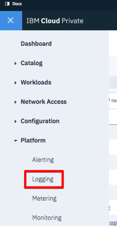
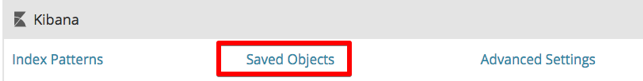
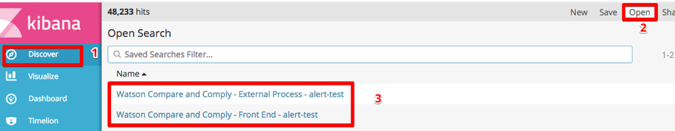

---

copyright:
years: 2017, 2018
lastupdated: "2018-03-23"

---

{:shortdesc: .shortdesc}
{:new_window: target="_blank"}
{:tip: .tip}
{:pre: .pre}
{:codeblock: .codeblock}
{:screen: .screen}
{:javascript: .ph data-hd-programlang='javascript'}
{:java: .ph data-hd-programlang='java'}
{:python: .ph data-hd-programlang='python'}
{:swift: .ph data-hd-programlang='swift'}

# Using logging
{: #using-logging}

## Installing and running the logging dashboards

To install the logging dashboard for {{site.data.keyword.cnc_short}}, perform the following steps.

  1. Download the Passport Advantage (PPA) file for {{site.data.keyword.cnc_short}}. The file is a zipped tar file with a name similar to `ibm-watson-compare-comply-prod-1.0.0.tar.gz`. The file includes the logging dashboard templates and a `bash` script to render the dashboards from the templates.

  1. Uncompress and expand the PPA file:
    ```bash
    $ mkdir ibm-watson-compare-comply-prod-1.0.0 && tar -xvzf ibm-watson-compare-comply-prod-1.0.0.tar.gz -C ibm-watson-compare-comply-prod-1.0.0
    ```
    {: codeblock}

  1. Change to the `charts` directory in the extracted directory:
    ```bash
    $ cd ibm-watson-compare-comply-prod-1.0.0/charts
    ```

  1. Uncompress and expand the zipped tar file in the `charts` directory:
    ```bash
    $ tar -xvzf ibm-watson-compare-comply-prod-1.0.0.tgz
    ```

  1. Change to the `dashboard` directory. It includes templates for metrics and logging, and a bash script to generate dashboards
from templates.

    ```bash
    $ cd ibm-watson-compare-comply-prod/dashboard

    $ tree
    .
    ├── alerts.json.tpl
    ├── external-process-logging.json.tpl
    ├── frontend-logging.json.tpl
    ├── metrics.json.tpl
    └── render-dashboards.sh

    0 directories, 5 files
    ```

  1. Run the `render-dashboards.sh` script to render the templates. Options for the script include:
  
    -  `-v, --version {chart_version}`: The chart version; for example, `1.0.0`.
    -  `-h, --help`: Print command help and exit.
    -  `-r, --release {release_name}`: The Helm release name.
    -  `-n, --namespace {namespace}`: The namespace of the deployment. The default namespace is `default`.

    ```bash
    $ ./render-dashboards.sh -v 1.0.0 -r my-test-release -n default
    The dashboard JSON files are generated under /Users/{user}/Downloads/ibm-watson-compare-comply-prod-1.0.0/charts/ibm-watson-compare-comply-prod/dashboard.

    $ tree
    .
    ├── alerts.json
    ├── alerts.json.tpl
    ├── external-process-logging.json
    ├── external-process-logging.json.tpl
    ├── frontend-logging.json
    ├── frontend-logging.json.tpl
    ├── metrics.json
    ├── metrics.json.tpl
    └── render-dashboards.sh

    0 directories, 9 files
    ```

## Importing the logging dashboards

To import the logging dashboards for {{site.data.keyword.cnc_short}} into IBM Cloud Private, perform the following steps.

  1. Log in to your IBM Cloud Private instance.

  1. From the Menu icon in the upper left-hand corner, select **Platform -> Logging**. <br />
     <br />
    

  1. Click **Management** on the left-hand side of the Kibana interface. <br />
    

  1. Select the **Saved Objects** tab.
    

  1. Select the **Searches** tab and click **Import**.
    

  1. Individually import the `frontend-logging.json` and `external-process-logging.json` files that were generated in Step 6 of the preceding procedure. When prompted, click **Yes, overwrite all**.
     

  1. The dashboards appear in the **Searches** tab.
     

## Viewing the logging dashboards

To view the logging dashboards, perform the following steps.

  1. Navigate to the **Discover** tab.

  1. Click **Open** near the top right-hand side of the Kibana interface.

  1. Select the dashboard you want to view. There are two logging dashboards, for the service log and the external process log.
    

You can easily change the time range and the frequency of auto-refreshing:
  
  
An accessible version of this page is available at: [https://www.ibm.com/watson/developercloud/compare-and-comply/doc/logging.html](https://www.ibm.com/watson/developercloud/compare-and-comply/doc/logging.html)
