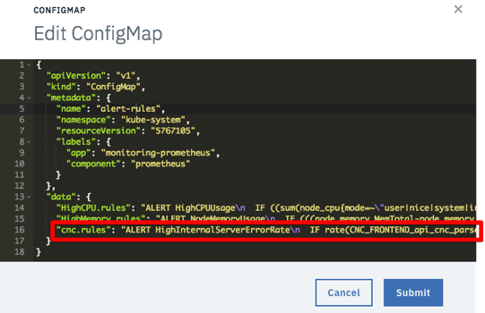
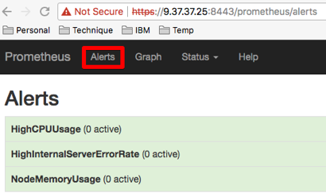
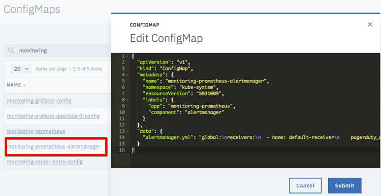

---

copyright:
  years: 2017, 2018
lastupdated: "2018-06-28"

---

{:shortdesc: .shortdesc}
{:new_window: target="_blank"}
{:tip: .tip}
{:pre: .pre}
{:codeblock: .codeblock}
{:screen: .screen}
{:javascript: .ph data-hd-programlang='javascript'}
{:java: .ph data-hd-programlang='java'}
{:python: .ph data-hd-programlang='python'}
{:swift: .ph data-hd-programlang='swift'}

# Alerts verwenden
{: #using-alerts}

Sie können Alerts für Ihren {{site.data.keyword.cnc_short}}-Cluster einrichten.

## Alertdashboard installieren

Führen Sie zum Installieren des Alertdashboards für {{site.data.keyword.cnc_short}} die folgenden Schritte aus.

 1. Laden Sie die Passport Advantage-Datei (PPA-Datei) für {{site.data.keyword.cnc_short}} herunter. Diese Datei liegt als komprimierte TAR-Datei vor, deren Benennung dem Muster `ibm-watson-compare-comply-prod-1.0.0.tar.gz` entspricht. Die Datei enthält die Vorlage für das Alertdashboard sowie ein `Bash`-Script für die Wiedergabe des Dashboards aus der Vorlage.

 1. Dekomprimieren und erweitern Sie die PPA-Datei:
  ```bash
  $ mkdir ibm-watson-compare-comply-prod-1.0.0 && tar -xvzf ibm-watson-compare-comply-prod-1.0.0.tar.gz -C ibm-watson-compare-comply-prod-1.0.0
  ```
  {: codeblock}

 1. Wechseln Sie im extrahierten Verzeichnis in das Verzeichnis `charts`:
   ```bash
   $ cd ibm-watson-compare-comply-prod-1.0.0/charts    
   ```

 1. Dekomprimieren und erweitern Sie die komprimierte TAR-Datei im Verzeichnis `charts`:
   ```bash
   $ tar -xvzf ibm-watson-compare-comply-prod-1.0.0.tgz
   ```

 1. Wechseln Sie in das Verzeichnis `dashboard`. Dieses Verzeichnis enthält Vorlagen für Metriken und für die Protokollierung sowie ein Bash-Script zum Generieren von Dashboards aus Vorlagen.

   ```bash
   $ cd ibm-watson-compare-comply-prod/dashboard

   $ tree
   .
   ├── alerts.json.tpl
   ├── external-process-logging.json.tpl
   ├── frontend-logging.json.tpl
   ├── metrics.json.tpl
   └── render-dashboards.sh

   0 directories, 5 files
   ```

  1. Führen Sie das Script `render-dashboards.sh` aus, damit die Vorlagen wiedergegeben werden. Für das Script gibt es die folgenden Ausführungsoptionen:
  
    -  `-v, --version {diagrammversion}`: Gibt die Diagrammversion an, zum Beispiel `1.0.0`.
    -  `-h, --help`: Gibt Hilfe für Befehle aus und wird dann beendet.
    -  `-r, --release {releasename}`: Der Name des Helm-Release.
    -  `-n, --namespace {namensbereich}`: Der Namensbereich der Bereitstellung. Der Standardnamensbereich lautet `default`.

   ```bash
   $ ./render-dashboards.sh -v 1.0.0 -r my-test-release -n default
   Die JSON-Dashboarddateien werden unter dem folgenden Verzeichnis generiert: /Users/{benutzer}/Downloads/ibm-watson-compare-comply-prod-1.0.0/charts/ibm-watson-compare-comply-prod/dashboard.

   $ tree
   .
   ├── alerts.json
   ├── alerts.json.tpl
   ├── external-process-logging.json
   ├── external-process-logging.json.tpl
   ├── frontend-logging.json
   ├── frontend-logging.json.tpl
   ├── metrics.json
   ├── metrics.json.tpl
   └── render-dashboards.sh

   0 directories, 9 files
   ```

## Alertregeln hinzufügen

Fügen Sie die Alertregeln durch Ausführen der folgenden Schritte zum Dashboard hinzu.

  1. Melden Sie sich bei Ihrem ICP-Cluster an.

  1. Wählen Sie über das Menüsymbol in der linken oberen Ecke die Optionen **Konfiguration -> ConfigMaps** aus.
       <br />
      

  1.  Die Seite **ConfigMaps** wird mit einer Tabelle von ConfigMap-Objekten geöffnet. Suchen Sie in der Tabelle die Zeile mit der Bezeichnung `alert-rules`. Klicken Sie in der Spalte **Action** der Zeile `alert-rules` auf das Menüsymbol und wählen Sie **Bearbeiten** aus.
     

  1. Öffnen Sie die Datei `.../ibm-watson-compare-comply-prod-1.0.0/charts/ibm-watson-compare-comply-prod/dashboard/alerts.json` in einem Texteditor und kopieren Sie die Zeile, die mit `cnc.rules` beginnt.

  1. Das Fenster **ConfigMap bearbeiten** wird geöffnet. Fügen Sie am Ende der letzten Zeile des Objekts `data` ein Komma hinzu und fügen Sie dann die `cnc.rules`-Zeile ein, die Sie im vorherigen Schritt kopiert haben. <br />
     

  1. Klicken Sie im Fenster **ConfigMap bearbeiten** auf **Abschicken**.

## Alertregeln anzeigen

Führen Sie zum Anzeigen der Liste von Alertregeln die folgenden Schritte aus.

  1. Navigieren Sie in auf Ihrem IBM Cloud Private-Cluster zum Prometheus-Dashboard. Das Prometheus-Dashboard befindet sich unter der Adresse `https://{IP-adresse_des_ICP-clusters}:{port_des_ICP-clusters}/prometheus`.

  1. Klicken Sie auf die Registerkarte **Alerts**. Das Prometheus-Dashboard zeigt eine Liste aller Alertregeln und die Anzahl aktiver Alerts für jede Regel an. <br />
    

## Alertbenachrichtigungen hinzufügen

Sie können Alertbenachrichtigungen für zahlreiche Paging-Systeme hinzufügen, wie unter anderem Slack, PagerDuty, HipChat, email. Prometheus stellt wie auf den folgenden Sites dokumentiert Unterstützung für Benachrichtigungen bereit:

 - [Dokumentation für die Konfiguration der Prometheus-Alertfunktion ](https://prometheus.io/docs/alerting/configuration/){: new_window}
 - [Dokumentation für Beispiele von Vorlagen für die Prometheus-Benachrichtigungsfunktion ](https://prometheus.io/docs/alerting/notification_examples/){: new_window}

Führen Sie zum Erstellen eines Benachrichtigungsempfängers für {{site.data.keyword.cnc_short}} auf IBM Cloud Private die folgenden Schritte aus.
{: #create-notification-receiver}

  1. Melden Sie sich bei Ihrem ICP-Cluster an.

  1. Wählen Sie über das Menüsymbol in der linken oberen Ecke die Optionen **Konfiguration -> ConfigMaps** aus. <br />
       <br />
      

  1.  Die Seite **ConfigMaps** wird mit einer Tabelle von ConfigMap-Objekten geöffnet. Suchen Sie in der Tabelle die Zeile mit der Bezeichnung `monitoring-prometheus-alertmanager`. Klicken Sie in der Spalte **Action** der Zeile `monitoring-prometheus-alertmanager` auf das Menüsymbol und wählen Sie **Bearbeiten** aus.

  1. Das Fenster **ConfigMap bearbeiten** wird geöffnet. Geben Sie im Objekt `data` die neuen Empfängerkonfigurationen ein.
     

  1. Klicken Sie im Fenster **ConfigMap bearbeiten** auf **Abschicken**.

### Beispiele

Führen Sie zum Erstellen einer Slack-Benachrichtigung die folgenden Schritte aus.

  1. Überprüfen Sie, ob der Slack-Zieltunnel vorhanden ist. Sollte dies nicht der Fall sein, erstellen Sie ihn. Detaillierte Informationen hierzu enthält die [Dokumentation für Slack zur Erstellung eines Kanals ](https://get.slack.help/hc/en-us/articles/201402297-Create-a-channel){: new_window}.

  1. Rufen Sie den Webhook für den Slack-Kanal ab oder erstellen Sie ihn. Detaillierte Informationen hierzu enthält die [Dokumentation für Slack zu Webhooks ](https://get.slack.help/hc/en-us/articles/115005265063-Incoming-WebHooks-for-Slack){: new_window}.

  1. Öffnen Sie die ConfigMap `monitoring-prometheus-alertmanager` im ConfigMap-Editor wie in [Alertbenachrichtigungen hinzufügen](#create-notification-receiver) beschrieben.

  1. Aktualisieren Sie das Objekt `data` in der ConfigMap wie folgt:
    ```
    "data": {
      "alertmanager.yml": "global: \n  slack_api_url: '{webhook-URL_für_Slack-kanal}' \nreceivers: \n  - name: default-receiver \n    slack_configs: \n    - channel: '#{Slack-kanal}' \n      send_resolved: true \nroute: \n  receiver: default-receiver \n  routes: \n  - match: \n    severity: critical \n   receiver: default-receiver"
    }
    ```
    {: codeblock}

  1. Klicken Sie im Fenster **ConfigMap bearbeiten** auf **Abschicken**.

Führen Sie zum Erstellen einer PagerDuty-Benachrichtigung die folgenden Schritte aus.

  1. Überprüfen Sie, ob der PagerDuty-Service vorhanden ist. Sollte dies nicht der Fall sein, erstellen Sie ihn. Detaillierte Informationen hierzu enthält die [Dokumentation für PagerDuty ](https://v2.developer.pagerduty.com/docs){: new_window}.

  1. Rufen Sie den PagerDuty-Integrationsschlüssel durch Hinzufügen der Prometheus-Integration an. Detaillierte Informationen hierzu enthält die [Dokumentation zur PagerDuty-API ](https://v2.developer.pagerduty.com/docs/events-api){: new_window}.

  1. Öffnen Sie die ConfigMap `monitoring-prometheus-alertmanager` im ConfigMap-Editor wie in [Alertbenachrichtigungen hinzufügen](#create-notification-receiver) beschrieben.

  1. Aktualisieren Sie das Objekt `data` in der ConfigMap wie folgt:
    ```
    "data": {
      "alertmanager.yml": "global:\nreceivers:\n  - name: default-receiver\n    pagerduty_configs:\n    - service_key: ' {PagerDuty-integrationsschlüssel}'\nroute:\n  receiver: default-receiver\n  routes:\n  - match:\n      severity: critical\n    receiver: default-receiver"
    }
    ```
    {: codeblock}

  1. Klicken Sie im Fenster **ConfigMap bearbeiten** auf **Abschicken**.
  
