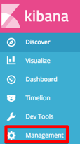

---

copyright:
years: 2017, 2018
lastupdated: "2018-07-25"

---

{:shortdesc: .shortdesc}
{:new_window: target="_blank"}
{:tip: .tip}
{:pre: .pre}
{:codeblock: .codeblock}
{:screen: .screen}
{:javascript: .ph data-hd-programlang='javascript'}
{:java: .ph data-hd-programlang='java'}
{:python: .ph data-hd-programlang='python'}
{:swift: .ph data-hd-programlang='swift'}

# Protokollierung verwenden
{: #logging}

## Protokollierungsdashboards importieren

Führen Sie zum Importieren der Protokollierungsdashboards für {{site.data.keyword.cnc_short}} in IBM Cloud Private die folgenden Schritte aus.

  1. Stellen Sie sicher, dass Sie die Protokollierungsdashboards extrahiert und generiert haben, wie im Abschnitt [Schritt 1: Dashboardvorlagen herunterladen, extrahieren und wiedergeben](/docs/services/compare-and-comply/monitor.html#monitor) beschrieben.

  1. Melden Sie sich bei Ihrem IBM Cloud Private-Cluster an.

  1. Wählen Sie über das Menüsymbol in der linken oberen Ecke die Optionen **Plattform -> Protokollierung** aus.  
      
    

  1. Klicken Sie auf der linken Seite der Kibana-Schnittstelle auf **Verwaltung**.  
    

  1. Wählen Sie die Registerkarte **Gespeicherte Objekte** aus.
    

  1. Wählen Sie die Registerkarte **Suchvorgänge** aus und klicken Sie auf **Importieren**.
    

  1. Importieren Sie nacheinander die Dateien `frontend-logging.json` und `external-process-logging.json`, die in der vorherigen Prozedur in Schritt 6 generiert wurden. Wenn eine entsprechende Eingabeaufforderung angezeigt wird, klicken Sie auf **Ja, alle überschreiben**.
     

  1. Die Dashboards werden auf der Registerkarte **Suchvorgänge** angezeigt.
     

## Protokollierungsdashboards anzeigen
{: #view}

Führen Sie zum Anzeigen der Protokollierungsdashboards die folgenden Schritte aus.

  1. Navigieren Sie zu der Registerkarte **Erkennen**.

  1. Klicken Sie im Bereich oben rechts der Kibana-Schnittstelle auf **Öffnen**.

  1. Wählen Sie das Dashboard aus, das angezeigt werden soll. Es gibt zwei Protokollierungsdashboards: eines für die Protokollierung des Serviceprotokolls und eines für die Protokollierung externer Prozesse.
    

Sie können den Zeitraum und die Häufigkeit der automatischen Aktualisierung der Anzeige ohne großen Aufwand ändern:
  

