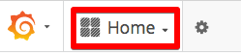

---

copyright:
  years: 2017, 2018
lastupdated: "2018-06-28"

---

{:shortdesc: .shortdesc}
{:new_window: target="_blank"}
{:tip: .tip}
{:pre: .pre}
{:codeblock: .codeblock}
{:screen: .screen}
{:javascript: .ph data-hd-programlang='javascript'}
{:java: .ph data-hd-programlang='java'}
{:python: .ph data-hd-programlang='python'}
{:swift: .ph data-hd-programlang='swift'}

# Metriken verwenden
{: #using-metrics}

Mithilfe des Überwachungsdashboards von IBM Cloud Private können Sie den Status von {{site.data.keyword.cnc_short}} überwachen. Das Überwachungsdashboard verwendet Grafana, Prometheus und Kibana, um detaillierte Informationen zu Ihrer Instanz von {{site.data.keyword.cnc_short}} darzustellen.

Weitere Informationen zum Überwachungsdashboard finden Sie im Knowledge Center unter [https://www.ibm.com/support/knowledgecenter/SSBS6K_2.1.0/manage_metrics/monitoring_service.html ](https://www.ibm.com/support/knowledgecenter/SSBS6K_2.1.0/manage_metrics/monitoring_service.html){: new_window}.

## Metrikdashboard installieren und ausführen

Führen Sie zum Installieren des Metrikdashboards für {{site.data.keyword.cnc_short}} die folgenden Schritte aus.

 1. Laden Sie die Passport Advantage-Datei (PPA-Datei) für {{site.data.keyword.cnc_short}} herunter. Diese Datei liegt als komprimierte TAR-Datei vor, deren Benennung dem Muster `ibm-watson-compare-comply-prod-1.0.0.tar.gz` entspricht. Die Datei enthält die Vorlage für das Metrikdashboard sowie ein `Bash`-Script für die Wiedergabe des Dashboards aus der Vorlage.

 1. Dekomprimieren und erweitern Sie die PPA-Datei:
  ```bash
  $ mkdir ibm-watson-compare-comply-prod-1.0.0 && tar -xvzf ibm-watson-compare-comply-prod-1.0.0.tar.gz -C ibm-watson-compare-comply-prod-1.0.0
  ```
  {: codeblock}

 1. Wechseln Sie im extrahierten Verzeichnis in das Verzeichnis `charts`:
   ```bash
   $ cd ibm-watson-compare-comply-prod-1.0.0/charts    
   ```

 1. Dekomprimieren und erweitern Sie die komprimierte TAR-Datei im Verzeichnis `charts`:
   ```bash
   $ tar -xvzf ibm-watson-compare-comply-prod-1.0.0.tgz
   ```

 1. Wechseln Sie in das Verzeichnis `dashboard`. Dieses Verzeichnis enthält Vorlagen für Metriken und für die Protokollierung sowie ein Bash-Script zum Generieren von Dashboards aus Vorlagen.

   ```bash
   $ cd ibm-watson-compare-comply-prod/dashboard

   $ tree
   .
   ├── alerts.json.tpl
   ├── external-process-logging.json.tpl
   ├── frontend-logging.json.tpl
   ├── metrics.json.tpl
   └── render-dashboards.sh

   0 directories, 5 files
   ```

  1. Führen Sie das Script `render-dashboards.sh` aus, damit die Vorlagen wiedergegeben werden. Für das Script gibt es die folgenden Ausführungsoptionen:
  
    -  `-v, --version {diagrammversion}`: Gibt die Diagrammversion an, zum Beispiel `1.0.0`.
    -  `-h, --help`: Gibt Hilfe für Befehle aus und wird dann beendet.
    -  `-r, --release {releasename}`: Der Name des Helm-Release.
    -  `-n, --namespace {namensbereich}`: Der Namensbereich der Bereitstellung. Der Standardnamensbereich lautet `default`.

   ```bash
   $ ./render-dashboards.sh -v 1.0.0 -r my-test-release -n default
   Die JSON-Dashboarddateien werden unter dem folgenden Verzeichnis generiert: /Users/{benutzer}/Downloads/ibm-watson-compare-comply-prod-1.0.0/charts/ibm-watson-compare-comply-prod/dashboard.

   $ tree
   .
   ├── alerts.json
   ├── alerts.json.tpl
   ├── external-process-logging.json
   ├── external-process-logging.json.tpl
   ├── frontend-logging.json
   ├── frontend-logging.json.tpl
   ├── metrics.json
   ├── metrics.json.tpl
   └── render-dashboards.sh

   0 directories, 9 files
   ```

## Metrikdashboard importieren

Führen Sie zum Importieren des Metrikdashboards für {{site.data.keyword.cnc_short}} in IBM Cloud Private die folgenden Schritte aus.

  1. Melden Sie sich bei Ihrem IBM Cloud Private-Cluster an.

  1. Wählen Sie über das Menüsymbol in der linken oberen Ecke die Optionen **Plattform -> Überwachung** aus. <br />
       <br />
      

  1. Klicken Sie im Bereich der linken oberen Ecke der Grafana-Schnittstelle auf **Home**. <br />
      

  1. Klicken Sie auf **Dashboard importieren**.
      

  1. Wählen Sie die Datei `metrics.json` aus, die in der vorherigen Prozedur in Schritt 6 generiert wurde, und klicken Sie dann auf **JSON-Datei hochladen**. <br />
      

  1. Wählen Sie **Prometheus** als Datenquelle aus und klicken Sie dann auf **Importieren**.
       

## Metrikdashboard anzeigen

Das Metrikdashboard ähnelt der folgenden Darstellung:


Sie können den Zeitraum und die Häufigkeit der automatischen Aktualisierung der Anzeige ohne großen Aufwand ändern:


## Metrikdashboard bearbeiten

Sie können das Metrikdashboard bearbeiten oder durch Ausführen der folgenden Schritte ein neues Metrikdashboard erstellen.

  1. Wählen Sie über das Menüsymbol in der linken oberen Ecke die Optionen **Plattform -> Überwachung** aus, um auf die Benutzerschnittstelle von Grafana zuzugreifen.

  1. Klicken Sie im Bereich der linken oberen Ecke der Grafana-Schnittstelle auf **Home** und anschließend auf **+ Neues Dashboard**.

  1. Wählen Sie aus, welcher Anzeigetyp hinzugefügt werden soll, beispielsweise **Diagramm** oder **Tabelle**.

  1. Klicken Sie auf die Anzeigenüberschrift und dann auf **Bearbeiten**. Die standardmäßige Anzeigenüberschrift lautet `Panel title`.

  1. Legen Sie auf der Registerkarte **Allgemein** die Überschrift für die Anzeige, eine Beschreibung und die Größe der Anzeige fest. Beachten Sie, dass 12 Einheiten der vollen Breite eines Browserfensters entsprechen.

  1. Verwenden Sie die Registerkarte **Metriken**, um Abfragen zu erstellen, die Daten aus Prometheus darstellen.

        1. Wenn Sie mit der Abfragesprache vertraut sind, können Sie die Abfrage direkt formulieren. Andernfalls verwenden Sie das Feld **Metriksuche**, um eine Auswahl bei den Metriken zu treffen, die gegenwärtig bei Prometheus gemeldet werden.

        1. Die Ergebnisse der Abfragen werden in Echtzeit in der neuen Dashboardanzeige angezeigt.

        1. Zu einer einzigen Anzeige können mehrere Abfragen hinzugefügt werden. Sie können beispielsweise Lese- und Schreiboperationen in demselben Diagramm oder die Gesamtzahl der Besuche wie auch der Besucher in derselben Tabelle anzeigen lassen.
        
