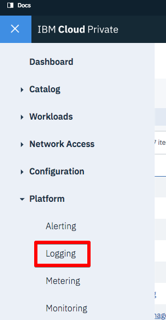
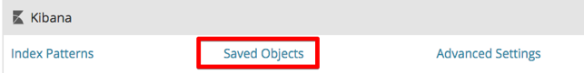

---

copyright:
years: 2017, 2018
lastupdated: "2018-07-25"

---

{:shortdesc: .shortdesc}
{:new_window: target="_blank"}
{:tip: .tip}
{:pre: .pre}
{:codeblock: .codeblock}
{:screen: .screen}
{:javascript: .ph data-hd-programlang='javascript'}
{:java: .ph data-hd-programlang='java'}
{:python: .ph data-hd-programlang='python'}
{:swift: .ph data-hd-programlang='swift'}

# Uso de los registros
{: #logging}

## Importación de los paneles de control de registro

Para importar los paneles de control de registro para {{site.data.keyword.cnc_short}} en IBM Cloud Private, efectúe los pasos siguientes.

  1. Asegúrese de que ha extraído y generado los paneles de control de registro como se describe en [Paso 1: Descargar, extraer y representar las plantillas de panel de control](/docs/services/compare-and-comply/monitor.html#monitor).

  1. Inicie sesión en el clúster de IBM Cloud Private.

  1. En el icono Menú de la esquina superior izquierda, seleccione **Plataforma -> Registro**.  
      
    

  1. Pulse **Gestión** en el lado izquierdo de la interfaz de Kibana.  
    

  1. Seleccione el separador **Objetos guardados**.
    

  1. Seleccione el separador **Búsquedas** y pulse **Importar**.
    

  1. Importe de forma individual los archivos `frontend-logging.json` y `external-process-logging.json` generados en el Paso 6 del procedimiento anterior. Cuando se le solicite, pulse **Sí, sobrescribir todo**.
     

  1. Los paneles de control aparecen en el separador **Búsquedas**.
     

## Visualización de los paneles de control de registro
{: #view}

Para ver los paneles de control de registro, efectúe los pasos siguientes.

  1. Navegue hasta el separador **Descubrir**.

  1. Pulse **Abrir** junto al lado superior derecho de la interfaz de Kibana.

  1. Seleccione el panel de control que desee ver. Hay dos paneles de control de registro, para el registro de servicio y el registro de proceso externo.
    

Puede cambiar fácilmente el rango de tiempo y la frecuencia de la renovación automática:
  

