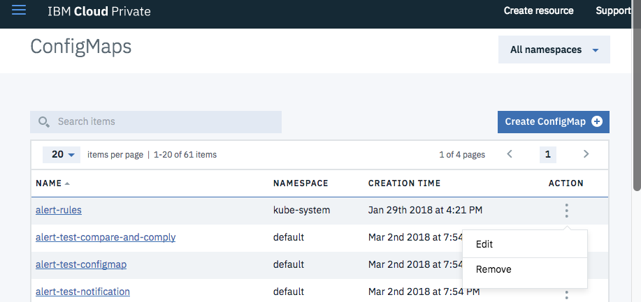

---

copyright:
  years: 2017, 2018
lastupdated: "2018-06-28"

---

{:shortdesc: .shortdesc}
{:new_window: target="_blank"}
{:tip: .tip}
{:pre: .pre}
{:codeblock: .codeblock}
{:screen: .screen}
{:javascript: .ph data-hd-programlang='javascript'}
{:java: .ph data-hd-programlang='java'}
{:python: .ph data-hd-programlang='python'}
{:swift: .ph data-hd-programlang='swift'}

# Utilisation d'alertes
{: #using-alerts}

Vous pouvez configurer des alertes pour votre cluster {{site.data.keyword.cnc_short}}. 

## Installation du tableau de bord des alertes

Pour installer le tableau de bord des alertes pour {{site.data.keyword.cnc_short}}, procédez comme suit :

 1. Téléchargez le fichier PPA (Passport Advantage) pour {{site.data.keyword.cnc_short}}. Il s'agit d'un fichier tar compressé portant un nom tel que `ibm-watson-compare-comply-prod-1.0.0.tar.gz`. Il inclut le modèle de tableau de bord des alertes et un script `bash` permettant d'afficher le rendu du tableau de bord à partir du modèle. 

 1. Décompressez et développez le fichier PPA :
  ```bash
  $ mkdir ibm-watson-compare-comply-prod-1.0.0 && tar -xvzf ibm-watson-compare-comply-prod-1.0.0.tar.gz -C ibm-watson-compare-comply-prod-1.0.0
  ```
  {: codeblock}

 1. Accédez au répertoire `charts` dans le répertoire ayant fait l'objet d'une extraction :
   ```bash
   $ cd ibm-watson-compare-comply-prod-1.0.0/charts    
   ```

 1. Décompressez et développez le fichier tar compressé dans le répertoire `charts` :
   ```bash
   $ tar -xvzf ibm-watson-compare-comply-prod-1.0.0.tgz
   ```

 1. Accédez au répertoire `dashboard`. Il comprend des modèles pour les métriques et la journalisation, ainsi qu'un script bash permettant de générer des tableaux de bord à partir des modèles.


   ```bash
   $ cd ibm-watson-compare-comply-prod/dashboard

   $ tree
   .
   ├── alerts.json.tpl
   ├── external-process-logging.json.tpl
   ├── frontend-logging.json.tpl
   ├── metrics.json.tpl
   └── render-dashboards.sh

   0 directories, 5 files
   ```

  1. Exécutez le script `render-dashboards.sh` pour afficher le rendu des modèles. Les options relatives au script sont notamment les suivantes :
  
    -  `-v, --version {chart_version}` : version du graphique, par exemple, `1.0.0`.
    -  `-h, --help` : aide et sortie de la commande d'impression. 
    -  `-r, --release {release_name}` : nom de l'édition Helm. 
    -  `-n, --namespace {namespace}` : espace de nom du déploiement. L'espace de nom par défaut est `default`.

   ```bash
   $ ./render-dashboards.sh -v 1.0.0 -r my-test-release -n default
   The dashboard JSON files are generated under /Users/{user}/Downloads/ibm-watson-compare-comply-prod-1.0.0/charts/ibm-watson-compare-comply-prod/dashboard.

   $ tree
   .
   ├── alerts.json
   ├── alerts.json.tpl
   ├── external-process-logging.json
   ├── external-process-logging.json.tpl
   ├── frontend-logging.json
   ├── frontend-logging.json.tpl
   ├── metrics.json
   ├── metrics.json.tpl
   └── render-dashboards.sh

   0 directories, 9 files
   ```

## Ajout de règles d'alerte

Pour ajouter les règles d'alerte au tableau de bord, procédez comme suit :

  1. Connectez-vous à votre cluster IBM Cloud Private. 

  1. A partir de l'icône de menu située dans l'angle supérieur gauche, sélectionnez **Configuration -> Objets ConfigMap**.
       <br />
      

  1. La page **Objets ConfigMap** s'ouvre avec un tableau d'objets Configmap. Dans le tableau, repérez la ligne `alert-rules`. Dans la colonne **Action** de la ligne `alert-rules`, cliquez sur l'icône de menu et sélectionnez **Editer**.
     

  1. Ouvrez le fichier `.../ibm-watson-compare-comply-prod-1.0.0/charts/ibm-watson-compare-comply-prod/dashboard/alerts.json` dans un éditeur de texte et copiez la ligne commençant par `cnc.rules`.

  1. La fenêtre **Editer ConfigMap** s'ouvre. Dans l'objet `data`, ajoutez une virgule à la fin de la dernière ligne de l'objet, puis collez dedans la ligne `cnc.rules` que vous avez copiée à l'étape précédente. <br />
     

  1. Cliquez sur **Soumettre** dans la fenêtre **Editer ConfigMap**. 

## Affichage des règles d'alerte

Pour afficher la liste de règles d'alerte, procédez comme suit :

  1. Accédez au tableau de bord Prometheus sur votre cluster IBM Cloud Private. Le tableau de bord Prometheus se trouve à l'adresse `https://{ICP_cluster_IP_address}:{ICP_cluster_port}/prometheus`.

  1. Cliquez sur l'onglet **Alertes**. Le tableau de bord Prometheus affiche une liste de toutes les règles d'alerte et le nombre d'alertes actives pour chacune d'elles. <br />
    

## Ajout de notifications d'alerte

Vous pouvez ajouter des notifications d'alerte pour un certain nombre de systèmes de pagination, y compris Slack, PagerDuty, HipChat, les courriers électroniques, etc. Prometheus fournit la prise en charge des notifications comme indiqué sur les sites suivants : 

 - [Configuration des alertes Prometheus ](https://prometheus.io/docs/alerting/configuration/){: new_window}
 - [Exemples de notification Prometheus ](https://prometheus.io/docs/alerting/notification_examples/){: new_window}

Pour créer un récepteur de notification pour {{site.data.keyword.cnc_short}} sur IBM Cloud Private, procédez comme suit :
{: #create-notification-receiver}

  1. Connectez-vous à votre cluster IBM Cloud Private. 

  1. A partir de l'icône de menu située dans l'angle supérieur gauche, sélectionnez **Configuration -> Objets ConfigMap**.
<br />
       <br />
      

  1. La page **Objets ConfigMap** s'ouvre avec un tableau d'objets Configmap. Dans le tableau, repérez la ligne `monitoring-prometheus-alertmanager`. Dans la colonne **Action** de la ligne `monitoring-prometheus-alertmanager`, cliquez sur l'icône de menu et sélectionnez **Editer**.

  1. La fenêtre **Editer ConfigMap** s'ouvre. Dans l'objet `data`, entrez les nouvelles configurations de récepteur.
     

  1. Cliquez sur **Soumettre** dans la fenêtre **Editer ConfigMap**. 

### Exemples

Pour créer une notification Slack, procédez comme suit :

  1. Vérifiez que le canal Slack cible existe. S'il n'existe pas, créez-le. Pour plus d'informations, voir la [documentation Slack sur la création d'un canal ](https://get.slack.help/hc/en-us/articles/201402297-Create-a-channel){: new_window}. 

  1. Procurez-vous ou créez le webhook pour le canal Slack. Pour plus d'informations, voir la [documentation Slack pour les webHooks ](https://get.slack.help/hc/en-us/articles/115005265063-Incoming-WebHooks-for-Slack){: new_window}. 

  1. Ouvrez le Configmap `monitoring-prometheus-alertmanager` dans l'éditeur de ConfigMap, comme illustré dans la rubrique [Ajout de notifications d'alerte](#create-notification-receiver).

  1. Mettez à jour l'objet `data` dans le ConfigMap comme suit :
    ```
    "data": {
      "alertmanager.yml": "global: \n  slack_api_url: '{WebHook_URL_for_Slack_channel}' \nreceivers: \n  - name: default-receiver \n    slack_configs: \n    - channel: '#{Slack_channel}' \n      send_resolved: true \nroute: \n  receiver: default-receiver \n  routes: \n  - match: \n    severity: critical \n   receiver: default-receiver"
    }
    ```
    {: codeblock}

  1. Dans la fenêtre **Editer ConfigMap**, cliquez sur **Soumettre**.

Pour créer une notification PagerDuty, procédez comme suit :

  1. Vérifiez que le service PagerDuty existe. S'il n'existe pas, créez-le. Pour plus d'informations, voir la [documentation PagerDuty](https://v2.developer.pagerduty.com/docs){: new_window}. 

  1. Obtenez la clé PagerDuty integration en ajoutant l'intégration Prometheus. Pour plus d'informations, voir la [documentation de l'API PagerDuty](https://v2.developer.pagerduty.com/docs/events-api){: new_window}. 

  1. Ouvrez le Configmap `monitoring-prometheus-alertmanager` dans l'éditeur de ConfigMap, comme illustré dans la rubrique [Ajout de notifications d'alerte](#create-notification-receiver).

  1. Mettez à jour l'objet `data` dans le ConfigMap comme suit :
    ```
    "data": {
      "alertmanager.yml": "global:\nreceivers:\n  - name: default-receiver\n    pagerduty_configs:\n    - service_key: ' {PagerDuty_integration_key}'\nroute:\n  receiver: default-receiver\n  routes:\n  - match:\n      severity: critical\n    receiver: default-receiver"
    }
    ```
    {: codeblock}

  1. Dans la fenêtre **Editer ConfigMap**, cliquez sur **Soumettre**.
  
