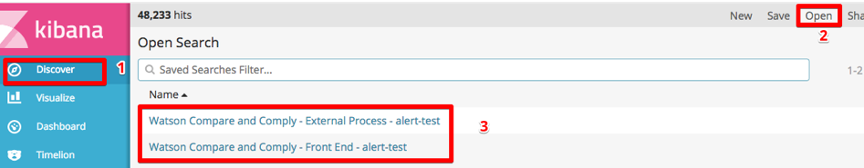

---

copyright:
years: 2017, 2018
lastupdated: "2018-07-25"

---

{:shortdesc: .shortdesc}
{:new_window: target="_blank"}
{:tip: .tip}
{:pre: .pre}
{:codeblock: .codeblock}
{:screen: .screen}
{:javascript: .ph data-hd-programlang='javascript'}
{:java: .ph data-hd-programlang='java'}
{:python: .ph data-hd-programlang='python'}
{:swift: .ph data-hd-programlang='swift'}

# Utilisation de la journalisation
{: #logging}

## Importation des tableaux de bord de journalisation

Afin d'importer les tableaux de bord de journalisation pour {{site.data.keyword.cnc_short}} dans IBM Cloud Private, procédez comme suit :

  1. Vérifiez que vous avez extrait et généré les tableaux de bord de journalisation comme indiqué dans [Etape 1 : Télécharger, extraire et afficher le rendu des modèles de tableau de bord](/docs/services/compare-and-comply/monitor.html#monitor).

  1. Connectez-vous à votre cluster IBM Cloud Private.

  1. A partir de l'icône de menu située dans l'angle supérieur gauche, sélectionnez **Plateforme -> Journalisation**.  
      
    

  1. Cliquez sur **Management** dans la partie gauche de l'interface Kibana.  
    

  1. Sélectionnez l'onglet **Saved Objects**.
    

  1. Sélectionnez l'onglet **Searches** et cliquez sur **Import**.
    

  1. Importez individuellement les fichiers `frontend-logging.json` et `external-process-logging.json` qui ont été générés à l'étape 6 de la procédure précédente. Lorsque vous y êtes invité, cliquez sur **Yes, overwrite all**.
     

  1. Les tableaux de bord s'affichent sur l'onglet **Searches**.
     

## Affichage des tableaux de bord de journalisation
{: #view}

Pour afficher les tableaux de bord de journalisation, procédez comme suit :

  1. Accédez à l'onglet **Discover**.

  1. Cliquez sur **Open** en haut à droite de l'interface Kibana.

  1. Sélectionnez le tableau de bord que vous souhaitez afficher. Il existe deux tableaux de bord de journalisation, pour le journal de maintenance et pour le journal de processus externe.
    

Vous pouvez facilement modifier l'intervalle et la fréquence d'actualisation automatique :
  

