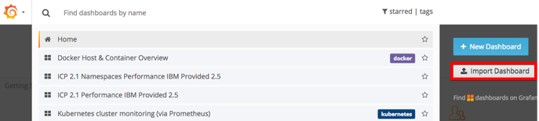
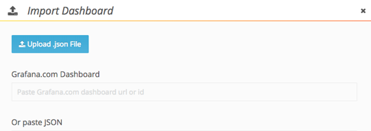

---

copyright:
  years: 2017, 2018
lastupdated: "2018-07-25"

---

{:shortdesc: .shortdesc}
{:new_window: target="_blank"}
{:tip: .tip}
{:pre: .pre}
{:codeblock: .codeblock}
{:screen: .screen}
{:javascript: .ph data-hd-programlang='javascript'}
{:java: .ph data-hd-programlang='java'}
{:python: .ph data-hd-programlang='python'}
{:swift: .ph data-hd-programlang='swift'}

# Utilisation de métriques
{: #metrics}

Vous pouvez surveiller l'état de {{site.data.keyword.cnc_short}} à l'aide du tableau de bord de surveillance d'IBM Cloud Private. Le tableau de bord de surveillance utilise Grafana pour les métriques, Prometheus pour les alertes et Kibana pour la journalisation afin de présenter des informations détaillées concernant votre instance {{site.data.keyword.cnc_short}}.

## Importation du tableau de bord des métriques

Afin d'importer le tableau de bord des métriques pour {{site.data.keyword.cnc_short}} dans IBM Cloud Private, procédez comme suit :

  1. Vérifiez que vous avez extrait et généré les tableaux de bord des métriques comme indiqué dans [Etape 1 : Télécharger, extraire et afficher le rendu des modèles de tableau de bord](/docs/services/compare-and-comply/monitor.html#monitor).

  1. Connectez-vous à votre cluster IBM Cloud Private.

  1. A partir de l'icône de menu située dans l'angle supérieur gauche, sélectionnez **Plateforme -> Surveillance**.  
        
      

  1. Cliquez sur **Home** dans l'angle supérieur gauche de l'interface Grafana.  
      

  1. Cliquez sur **Import Dashboard**.
      

  1. Sélectionnez le fichier `metrics.json` qui a été généré à l'étape 6 de la procédure précédente, puis cliquez sur **Upload .json File**.  
      

  1. Sélectionnez **Prometheus** comme source de données, puis cliquez sur **Import**.
       

## Affichage du tableau de bord des métriques
{: #view}

Le tableau de bord des métriques se présente comme suit :

Vous pouvez facilement modifier l'intervalle et la fréquence d'actualisation automatique :

## Edition du tableau de bord des métriques

Vous pouvez éditer le tableau de bord des métriques ou créer un nouveau tableau de bord en procédant comme suit :

  1. A partir de l'icône de menu située dans l'angle supérieur gauche, sélectionnez **Plateforme -> Surveillance** pour accéder à l'interface utilisateur Grafana.

  1. Cliquez sur **Home** dans l'angle supérieur gauche de l'interface Grafana, puis cliquez sur **+ New Dashboard**.

  1. Sélectionnez le type de panneau que vous souhaitez ajouter, par exemple, **Graph** ou **Table**.

  1. Cliquez sur le titre de panneau, puis sur **Edit**. Le titre de panneau par défaut est `Panel title`.

  1. Utilisez l'onglet **General** pour définir le titre, la description et les dimensions du panneau. Notez que la pleine largeur d'une fenêtre de navigateur correspond à 12 unités.

  1. Utilisez l'onglet **Metrics** pour créer des requêtes permettant d'afficher des données à partir de Prometheus.

    1. Vous pouvez écrire la requête directement si vous connaissez le langage de requête ou vous pouvez utiliser la zone **Metric lookup** pour effectuer une sélection parmi les métriques actuellement signalées à Prometheus.

    1. Les résultats des requêtes sont affichés en temps réel dans le nouveau panneau de tableau de bord.

    1. Plusieurs requêtes peuvent être ajoutées à un panneau. Par exemple, vous pouvez afficher des opérations de lecture et d'écriture sur le même diagramme ou le nombre total de visites et le nombre total de visiteurs dans le même tableau.
        
