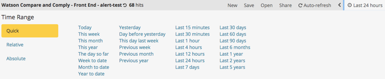

---

copyright:
years: 2017, 2018
lastupdated: "2018-07-25"

---

{:shortdesc: .shortdesc}
{:new_window: target="_blank"}
{:tip: .tip}
{:pre: .pre}
{:codeblock: .codeblock}
{:screen: .screen}
{:javascript: .ph data-hd-programlang='javascript'}
{:java: .ph data-hd-programlang='java'}
{:python: .ph data-hd-programlang='python'}
{:swift: .ph data-hd-programlang='swift'}

# ロギングの使用
{: #logging}

## ロギング・ダッシュボードのインポート

{{site.data.keyword.cnc_short}} のロギング・ダッシュボードを IBM Cloud Private にインポートするには、以下のステップを実行します。

  1. [ステップ 1: ダッシュボード・テンプレートのダウンロード、抽出、レンダリング](/docs/services/compare-and-comply/monitor.html#monitor)の説明に従ってロギング・ダッシュボードを抽出し生成してあることを確認します。

  1. IBM Cloud Private クラスターにログインします。

  1. 左上隅のメニュー・アイコンから、**「プラットフォーム」->「ロギング」**を選択します。  
      
    

  1. Kibana インターフェースの左側の**「Management」**をクリックします。  
    

  1. **「Saved Objects」**タブを選択します。
    

  1. **「Searches」**タブを選択し、**「Import」**をクリックします。
    

  1. 前の手順のステップ 6 で生成した `frontend-logging.json` ファイルと `external-process-logging.json` ファイルを個別にインポートします。 プロンプトが出されたら、**「Yes, overwrite all」**をクリックします。
     

  1. **「Searches」**タブにダッシュボードが表示されます。
     

## ロギング・ダッシュボードの表示
{: #view}

ロギング・ダッシュボードを表示するには、以下のステップを実行します。

  1. **「Discover」**タブにナビゲートします。

  1. Kibana インターフェースの右上付近の**「Open」**をクリックします。

  1. 表示するダッシュボードを選択します。 保守ログ用と外部プロセス・ログ用の 2 つのロギング・ダッシュボードがあります。
    

時刻範囲と自動最新表示の頻度は簡単に変更できます。
  

