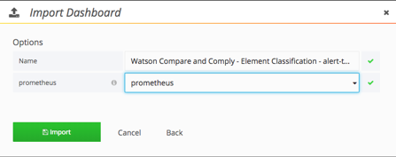

---

copyright:
  years: 2017, 2018
lastupdated: "2018-06-28"

---

{:shortdesc: .shortdesc}
{:new_window: target="_blank"}
{:tip: .tip}
{:pre: .pre}
{:codeblock: .codeblock}
{:screen: .screen}
{:javascript: .ph data-hd-programlang='javascript'}
{:java: .ph data-hd-programlang='java'}
{:python: .ph data-hd-programlang='python'}
{:swift: .ph data-hd-programlang='swift'}

# メトリックの使用
{: #using-metrics}

IBM Cloud Private のモニタリング・ダッシュボードを使用して、{{site.data.keyword.cnc_short}} の状況をモニターできます。モニタリング・ダッシュボードは、Grafana、Prometheus、および Kibana を使用して {{site.data.keyword.cnc_short}} インスタンスに関する詳細情報を提供します。

モニタリング・ダッシュボードについて詳しくは、[https://www.ibm.com/support/knowledgecenter/SSBS6K_2.1.0/manage_metrics/monitoring_service.html ](https://www.ibm.com/support/knowledgecenter/SSBS6K_2.1.0/manage_metrics/monitoring_service.html){: new_window} を参照してください。

## メトリック・ダッシュボードのインストールと実行

{{site.data.keyword.cnc_short}} のメトリック・ダッシュボードをインストールするには、以下のステップを実行します。

 1. {{site.data.keyword.cnc_short}} のパスポート・アドバンテージ (PPA) ファイルをダウンロードします。このファイルは、`ibm-watson-compare-comply-prod-1.0.0.tar.gz` のような名前の zip 圧縮された tar ファイルです。このファイルには、メトリック・ダッシュボード・テンプレートと、テンプレートからダッシュボードをレンダリングするための `bash` スクリプトが含まれています。

 1. PPA ファイルを圧縮解除して展開します。
  ```bash
  $ mkdir ibm-watson-compare-comply-prod-1.0.0 && tar -xvzf ibm-watson-compare-comply-prod-1.0.0.tar.gz -C ibm-watson-compare-comply-prod-1.0.0
  ```
  {: codeblock}

 1. 解凍されたディレクトリー内で `charts` ディレクトリーに移動します。
   ```bash
   $ cd ibm-watson-compare-comply-prod-1.0.0/charts    
   ```

 1. `charts` ディレクトリー内の zip 圧縮された tar ファイルを圧縮解除して展開します。
   ```bash
   $ tar -xvzf ibm-watson-compare-comply-prod-1.0.0.tgz
   ```

 1. `dashboard` ディレクトリーに移動します。そこには、メトリックとロギングに関するテンプレートと、そのテンプレートからダッシュボードを生成するための bash スクリプトが含まれています。


   ```bash
   $ cd ibm-watson-compare-comply-prod/dashboard

   $ tree
   .
   ├── alerts.json.tpl
   ├── external-process-logging.json.tpl
   ├── frontend-logging.json.tpl
   ├── metrics.json.tpl
   └── render-dashboards.sh

   0 directories, 5 files
   ```

  1. `render-dashboards.sh` スクリプトを実行して、テンプレートをレンダリングします。スクリプトのオプションは以下のとおりです。
  
    -  `-v, --version {chart_version}`: 図表のバージョン。`1.0.0` など。
    -  `-h, --help`: コマンド・ヘルプを出力して終了します。
    -  `-r, --release {release_name}`: Helm のリリース名。
    -  `-n, --namespace {namespace}`: デプロイメントの名前空間。デフォルトの名前空間は `default` です。

   ```bash
   $ ./render-dashboards.sh -v 1.0.0 -r my-test-release -n default
   The dashboard JSON files are generated under /Users/{user}/Downloads/ibm-watson-compare-comply-prod-1.0.0/charts/ibm-watson-compare-comply-prod/dashboard.

   $ tree
   .
   ├── alerts.json
   ├── alerts.json.tpl
   ├── external-process-logging.json
   ├── external-process-logging.json.tpl
   ├── frontend-logging.json
   ├── frontend-logging.json.tpl
   ├── metrics.json
   ├── metrics.json.tpl
   └── render-dashboards.sh

   0 directories, 9 files
   ```

## メトリック・ダッシュボードのインポート

{{site.data.keyword.cnc_short}} のメトリック・ダッシュボードを IBM Cloud Private にインポートするには、以下のステップを実行します。

  1. IBM Cloud Private クラスターにログインします。

  1. 左上隅のメニュー・アイコンから、**「プラットフォーム」->「モニタリング」**を選択します。<br />
       <br />
      

  1. Grafana インターフェースの左上付近の**「Home」**をクリックします。<br />
      

  1. **「Import Dashboard」**をクリックします。
      

  1. 前の手順のステップ 6 で生成した `metrics.json` ファイルを選択し、**「Upload .json File」**をクリックします。<br />
      

  1. データ・ソースとして**「Prometheus」**を選択してから、**「Import」**をクリックします。
       

## メトリック・ダッシュボードの表示

メトリック・ダッシュボードは以下のようなものです。


時刻範囲と自動最新表示の頻度は簡単に変更できます。


## メトリック・ダッシュボードの編集

メトリック・ダッシュボードの編集や新規ダッシュボードの作成を行うには、以下のステップを実行します。

  1. 左上隅のメニュー・アイコンから、**「プラットフォーム」->「モニタリング」**を選択し、Grafana UI にアクセスします。

  1. Grafana インターフェースの左上付近の**「Home」**をクリックしてから、**「+ New Dashboard」**をクリックします。

  1. **「Graph」**や**「Table」**など、追加するパネルのタイプを選択します。

  1. パネル・タイトルをクリックしてから、**「Edit」**をクリックします。デフォルトのパネル・タイトルは`「Panel title」`です。

  1. **「General」**タブを使用してパネルのタイトル、説明、大きさを設定します。12 ユニットでブラウザー・ウィンドウの全幅になります。

  1. **「Metrics」**タブを使用して、Prometheus からのデータを表示する照会を作成します。

        1. 照会言語に詳しければ照会を直接記述できます。**「Metric lookup」**フィールドを使用して、現在 Prometheus に報告されているメトリックから選択することもできます。

        1. 照会結果が新しいダッシュボード・パネルにリアルタイムで表示されます。

        1. 複数の照会を 1 つのパネルに追加することができます。例えば、読み取り操作と書き込み操作を同じグラフに表示したり、合計アクセス数と合計訪問者数を同じ表に表示したりできます。
        
