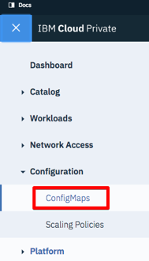

---

copyright:
  years: 2017, 2018
lastupdated: "2018-07-25"

---

{:shortdesc: .shortdesc}
{:new_window: target="_blank"}
{:tip: .tip}
{:pre: .pre}
{:codeblock: .codeblock}
{:screen: .screen}
{:javascript: .ph data-hd-programlang='javascript'}
{:java: .ph data-hd-programlang='java'}
{:python: .ph data-hd-programlang='python'}
{:swift: .ph data-hd-programlang='swift'}

# 모니터링 경보 사용
{: #alerts}

다음 절에서 설명하는 대로 경보 대시보드를 가져온 후에 {{site.data.keyword.cnc_short}} 인스턴스에 대한 Prometheus 경보를 설정할 수 있습니다. 

## 경보 대시보드 가져오기 및 경보 규칙 추가
{: #import}

경보 대시보드를 가져오고 대시보드에 경보 규칙을 추가하려면 다음 단계를 수행하십시오. 

  1. [1단계: 대시보드 템플리트의 다운로드, 추출 및 렌더링](/docs/services/compare-and-comply/monitor.html#monitor)에서 설명한 대로 경보 대시보드를 추출하고 생성했는지 확인하십시오.   

  1. ICP 클러스터에 로그인하십시오.

  1. 왼쪽 상단 모서리에 있는 메뉴 아이콘에서 **구성 -> ConfigMaps**를 선택하십시오.
       <br />
      

  1. **ConfigMaps** 페이지가 열리며 configmaps 테이블이 표시됩니다. 테이블에서 `alert-rules` 행을 찾으십시오. `alert-rules` 행의 **조치** 열에서 메뉴 아이콘을 클릭하고 **편집**을 선택하십시오.
     

  1. 텍스트 편집기에서 `.../ibm-watson-compare-comply-prod-1.0.0/charts/ibm-watson-compare-comply-prod/dashboard/alerts.json` 파일을 열고 `cnc.rules`로 시작되는 행을 복사하십시오.

  1. **ConfigMap 편집** 창이 열립니다. `data` 오브젝트에서 오브젝트의 마지막 행의 끝에 쉼표를 추가한 다음 이전 단계에서 복사한 `cnc.rules` 행에 붙여넣으십시오. <br />
     

  1. **ConfigMap 편집** 창에서 **제출**을 클릭하십시오.

## 경보 규칙 보기

경보 규칙 목록을 보려면 다음 단계를 수행하십시오.

  1. IBM Cloud Private 클러스터의 Prometheus 대시보드로 이동하십시오. Prometheus 대시보드는 `https://{ICP_cluster_IP_address}:{ICP_cluster_port}/prometheus`에 있습니다.

  1. **경보** 탭을 클릭하십시오. Prometheus 대시보드에 모든 경보 규칙 목록 및 각각에 대한 활성 경보 수가 표시됩니다. <br />
    

## 경보 알림 추가

Slack, PagerDuty, HipChat, 이메일 및 기타를 포함해 여러 페이징 시스템에 대한 경보 알림을 추가할 수 있습니다. Prometheus에서는 다음 사이트에 설명된 대로 알림을 지원합니다.

 - [Prometheus 경보 구성 문서 ](https://prometheus.io/docs/alerting/configuration/){: new_window}
 - [Prometheus 알림 예제 문서 ](https://prometheus.io/docs/alerting/notification_examples/){: new_window}

IBM Cloud Private의 {{site.data.keyword.cnc_short}}에 대한 알림 수신기를 작성하려면 다음 단계를 수행하십시오.
{: #create-notification-receiver}

  1. ICP 클러스터에 로그인하십시오.

  1. 왼쪽 상단 모서리에 있는 메뉴 아이콘에서 **구성 -> ConfigMaps**를 선택하십시오. <br />
       <br />
      

  1. **ConfigMaps** 페이지가 열리며 configmaps 테이블이 표시됩니다. 테이블에서 `monitoring-prometheus-alertmanager` 행을 찾으십시오. `monitoring-prometheus-alertmanager` 행의 **조치** 열에서 메뉴 아이콘을 클릭하고 **편집**을 선택하십시오.

  1. **ConfigMap 편집** 창이 열립니다. `data` 오브젝트에서 새 수신기 구성을 입력하십시오.
     

  1. **ConfigMap 편집** 창에서 **제출**을 클릭하십시오.

### 예제

Slack 알림을 작성하려면 다음 단계를 수행하십시오.

  1. 대상 Slack 채널이 있는지 확인하십시오. 없는 경우 작성하십시오. 세부사항은 [채널 작성에 대한 Slack 문서 ](https://get.slack.help/hc/en-us/articles/201402297-Create-a-channel){: new_window}를 참조하십시오.

  1. Slack 채널의 웹훅을 얻거나 작성하십시오. 세부사항은 [웹훅에 대한 Slack 문서 ](https://get.slack.help/hc/en-us/articles/115005265063-Incoming-WebHooks-for-Slack){: new_window}를 참조하십시오.

  1. [경보 알림 추가](#create-notification-receiver)에 설명된 대로 ConfigMap 편집기에서 `monitoring-prometheus-alertmanager` ConfigMap을 여십시오.

  1. 다음과 같이 ConfigMap에서 `data` 오브젝트를 업데이트하십시오.
    ```
    "data": {
      "alertmanager.yml": "global: \n  slack_api_url: '{WebHook_URL_for_Slack_channel}' \nreceivers: \n  - name: default-receiver \n    slack_configs: \n    - channel: '#{Slack_channel}' \n      send_resolved: true \nroute: \n  receiver: default-receiver \n  routes: \n  - match: \n    severity: critical \n   receiver: default-receiver"
    }
    ```
    {: codeblock}

  1. **ConfigMap 편집** 창에서 **제출**을 클릭하십시오.

PagerDuty 알림을 작성하려면 다음 단계를 수행하십시오.

  1. PagerDuty 서비스가 있는지 확인하십시오. 없는 경우 작성하십시오. 세부사항은 [PagerDuty 문서 ](https://v2.developer.pagerduty.com/docs){: new_window}를 참조하십시오.

  1. Prometheus 통합을 추가하여 PagerDuty 통합 키를 가져오십시오. 세부사항은 [PagerDuty API 문서 ](https://v2.developer.pagerduty.com/docs/events-api){: new_window}를 참조하십시오.

  1. [경보 알림 추가](#create-notification-receiver)에 설명된 대로 ConfigMap 편집기에서 `monitoring-prometheus-alertmanager` ConfigMap을 여십시오.

  1. 다음과 같이 ConfigMap에서 `data` 오브젝트를 업데이트하십시오.
    ```
    "data": {
      "alertmanager.yml": "global:\nreceivers:\n  - name: default-receiver\n    pagerduty_configs:\n    - service_key: ' {PagerDuty_integration_key}'\nroute:\n  receiver: default-receiver\n  routes:\n  - match:\n      severity: critical\n    receiver: default-receiver"
    }
    ```
    {: codeblock}

  1. **ConfigMap 편집** 창에서 **제출**을 클릭하십시오.
  
