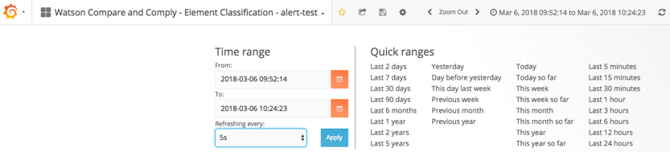

---

copyright:
  years: 2017, 2018
lastupdated: "2018-06-28"

---

{:shortdesc: .shortdesc}
{:new_window: target="_blank"}
{:tip: .tip}
{:pre: .pre}
{:codeblock: .codeblock}
{:screen: .screen}
{:javascript: .ph data-hd-programlang='javascript'}
{:java: .ph data-hd-programlang='java'}
{:python: .ph data-hd-programlang='python'}
{:swift: .ph data-hd-programlang='swift'}

# Usando métricas
{: #using-metrics}

É possível monitorar o status do {{site.data.keyword.cnc_short}} usando o painel de
monitoramento do IBM Cloud Private. O painel de monitoramento usa o Grafana, o Prometheus e o Kibana para
apresentar informações detalhadas sobre sua instância do {{site.data.keyword.cnc_short}}.

Para obter mais informações sobre o painel de monitoramento, consulte
[https://www.ibm.com/support/knowledgecenter/SSBS6K_2.1.0/manage_metrics/monitoring_service.html](https://www.ibm.com/support/knowledgecenter/SSBS6K_2.1.0/manage_metrics/monitoring_service.html){: new_window}.


## Instalando e executando o painel de métricas

Para instalar o painel de métricas para o {{site.data.keyword.cnc_short}}, execute as etapas a
seguir.

 1. Faça download do arquivo do Passport Advantage (PPA) para o {{site.data.keyword.cnc_short}}. O arquivo é um arquivo tar compactado com um nome semelhante a `ibm-watson-compare-comply-prod-1.0.0.tar.gz`. O arquivo inclui o modelo de painel de métricas e um script `bash` para renderizar o
painel por meio do modelo.

 1. Descompacte e expanda o arquivo PPA:
  ```bash
  $ mkdir ibm-watson-compare-comply-prod-1.0.0 &&  tar -xvzf ibm-watson-compare-comply-prod-1.0.0.tar.gz -C ibm-watson-compare-comply-prod-1.0.0
  ```
  {: codeblock}

 1. Mude para o diretório `charts` no diretório extraído:
   ```bash
   $cd ibm-watson-compare-compley-prod-1.0.0/charts    
   ```

 1. Descompacte e expanda o arquivo tar compactado no diretório `charts`:
   ```bash
   $ tar -xvzf ibm-watson-compare-comply-prod-1.0.0.tgz
   ```

 1. Mude para o diretório  ` dashboard ` . Inclui modelos para métricas e criação de log e um script de bash para gerar painéis dos modelos.

   ```bash
   $cd ibm-watson-compare-UNK-prod/dashboard

   $árvore.
   UNK -- alerts.json.tpl
   UNK -- external-process-logging.json.tpl
   UNK -- frontend-logging.json.tpl
   UNK -- metrics.json.tpl
   UNK -- render-dashboards.sh

   0 diretórios, 5 arquivos
   ```

  1. Executar o script `render-dashboards.sh` para renderizar os modelos. As opções para o script incluem:
  
    -  `-v, --version {chart_version}`: a versão do diagrama, por exemplo, `1.0.0`.
    -  `-h, --help`: imprimir a ajuda do comando e sair.
    -  `-r, --release {release_name}`: o nome da liberação do Helm.
    -  `-n, --namespace {namespace}`: o espaço de nomes da implementação. O namespace padrão é `default`.

   ```bash
   $./render-dashboards.sh -v 1.0.0 -r my-test-release -n default The dashboard JSON files are generated under /Users/{user}/Downloads/ibm-watson-compare-comply-prod-1.0.0/charts/ibm-watson-compare-comply-prod/dashboard.

   $árvore.
   UNK -- alerts.json
   UNK -- alerts.json.tpl
   ├── external-process-logging.json
   UNK -- external-process-logging.json.tpl
   UNK -- frontend-logging.json
   UNK -- frontend-logging.json.tpl
   UNK -- metrics.json
   UNK -- metrics.json.tpl
   UNK -- render-dashboards.sh

   0 diretórios, 9 arquivos
   ```

## Importando o painel de métricas

Para importar o painel de métricas para o {{site.data.keyword.cnc_short}} no IBM Cloud
Private, execute as etapas a seguir.

  1. Efetue login em seu cluster do IBM Cloud Private.

  1. No ícone de Menu no canto superior esquerdo, selecione
**Plataforma -> Monitoramento**. <br />
       <br />
      

  1. Clique em **Início** próximo ao canto superior esquerdo da interface do Grafana. <br />
      

  1. Clique em **Importar painel**.
      

  1. Selecione o arquivo `metrics.json` que foi gerado na Etapa 6 do procedimento
anterior e, em seguida, clique em **Fazer upload do arquivo .json**. <br />
      

  1. Selecione **Prometheus** como a origem de dados e, em seguida, clique em
**Importar**.


## Visualizando o painel de métricas

O painel de métricas se assemelha ao seguinte:


É possível mudar facilmente o intervalo de tempo e a frequência de atualização automática:


## Editando o painel de métricas

É possível editar o painel de métricas ou criar um novo painel executando as etapas a seguir.

  1. No ícone de Menu no canto superior esquerdo, selecione **Plataforma-> Monitoramento**
para acessar a UI do Grafana.

  1. Clique em **Início** próximo ao canto superior esquerdo da interface
do Grafana e, em seguida, clique em **+ Novo painel**.

  1. Selecione o tipo de painel que você deseja incluir, como **Gráfico** ou
**Tabela**.

  1. Clique no título do painel e, em seguida, clique em **Editar**. O título do
painel padrão é `Título do painel`.

  1. Use a guia **Geral** para configurar o título, a descrição e as dimensões
do painel. Observe que 12 unidades é a largura total de uma janela do navegador.

  1. Use a guia **Métricas** para criar consultas que exibem dados do Prometheus.

        1. É possível gravar a consulta diretamente se você estiver familiarizado com a linguagem de
consulta ou usar o campo **Consulta de métrica** para escolher dentre as métricas que
estão sendo relatadas atualmente ao Prometheus.

        1. Os resultados das consultas são exibidos em tempo real na nova área do painel.

        1. Múltiplas consultas podem ser incluídas em um único painel. Por exemplo, é possível exibir
operações de leitura e gravação no mesmo gráfico ou o total de visitas e o total de visitantes na mesma tabela.
        
