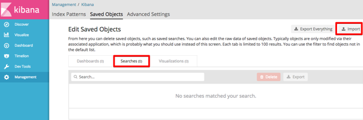
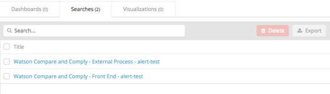
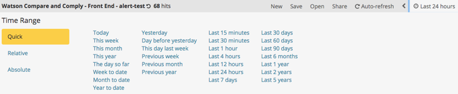

---

copyright:
years: 2017, 2018
lastupdated: "2018-03-23"

---

{:shortdesc: .shortdesc}
{:new_window: target="_blank"}
{:tip: .tip}
{:pre: .pre}
{:codeblock: .codeblock}
{:screen: .screen}
{:javascript: .ph data-hd-programlang='javascript'}
{:java: .ph data-hd-programlang='java'}
{:python: .ph data-hd-programlang='python'}
{:swift: .ph data-hd-programlang='swift'}

# 使用日志记录
{: #using-logging}

## 安装并运行日志记录仪表板

要安装 {{site.data.keyword.cnc_short}} 的日志记录仪表板，请执行以下步骤。

  1. 下载 {{site.data.keyword.cnc_short}} 的 Passport Advantage (PPA) 文件。该文件是压缩的 tar 文件，名称类似于 `ibm-watson-compare-comply-prod-1.0.0.tar.gz`。该文件包含日志记录仪表板模板以及用于基于该模板呈现仪表板的 `bash` 脚本。

  1. 解压缩 PPA 文件：
    ```bash
    $ mkdir ibm-watson-compare-comply-prod-1.0.0 && tar -xvzf ibm-watson-compare-comply-prod-1.0.0.tar.gz -C ibm-watson-compare-comply-prod-1.0.0
    ```
    {: codeblock}

  1. 切换到解压缩目录中的 `charts` 目录：
    ```bash
    $ cd ibm-watson-compare-comply-prod-1.0.0/charts
    ```

  1. 解压缩 `charts` 目录中的压缩 tar 文件：
    ```bash
    $ tar -xvzf ibm-watson-compare-comply-prod-1.0.0.tgz
    ```

  1. 切换到 `dashboard` 目录。此目录包括度量值和日志记录的模板，以及用于基于模板生成仪表板的 bash 脚本。

    ```bash
    $ cd ibm-watson-compare-comply-prod/dashboard

    $ tree
    .
    ├── alerts.json.tpl
    ├── external-process-logging.json.tpl
    ├── frontend-logging.json.tpl
    ├── metrics.json.tpl
    └── render-dashboards.sh

    0 directories, 5 files
    ```

  1. 运行 `render-dashboards.sh` 脚本以呈现模板。用于脚本的选项包括：
  
    -  `-v, --version {chart_version}`：图表版本；例如，`1.0.0`。
    -  `-h, --help`：打印命令帮助并退出。
    -  `-r, --release {release_name}`：Helm 发行版名称。
    -  `-n, --namespace {namespace}`：部署的名称空间。缺省名称空间为 `default`。

    ```bash
    $ ./render-dashboards.sh -v 1.0.0 -r my-test-release -n default
    The dashboard JSON files are generated under /Users/{user}/Downloads/ibm-watson-compare-comply-prod-1.0.0/charts/ibm-watson-compare-comply-prod/dashboard.

    $ tree
    .
    ├── alerts.json
    ├── alerts.json.tpl
    ├── external-process-logging.json
    ├── external-process-logging.json.tpl
    ├── frontend-logging.json
    ├── frontend-logging.json.tpl
    ├── metrics.json
    ├── metrics.json.tpl
    └── render-dashboards.sh

    0 directories, 9 files
    ```

## 导入日志记录仪表板

要将 {{site.data.keyword.cnc_short}} 的日志记录仪表板导入到 IBM Cloud Private 中，请执行以下步骤。

  1. 登录到 IBM Cloud Private 集群。

  1. 从左上角的“菜单”图标中，选择**平台 -> 日志记录**。<br />
     <br />
    

  1. 单击 Kibana 界面左侧的**管理**。<br />
    

  1. 选择**已保存的对象**选项卡。
    

  1. 选择**搜索**选项卡，然后单击**导入**。
    

  1. 分别导入在先前过程的步骤 6 中生成的 `frontend-logging.json` 和 `external-process-logging.json` 文件。出现提示时，单击**是，全部覆盖**。
     

  1. 仪表板将显示在**搜索**选项卡中。
     

## 查看日志记录仪表板

要查看日志记录仪表板，请执行以下步骤。

  1. 导航至**发现**选项卡。

  1. 单击 Kibana 界面右上方附近的**打开**。

  1. 选择要查看的仪表板。有两个日志记录仪表板，分别用于服务日志和外部进程日志。
    

您可以轻松更改时间范围和自动刷新频率：
  

