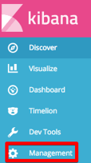
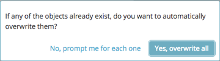

---

copyright:
years: 2017, 2018
lastupdated: "2018-03-23"

---

{:shortdesc: .shortdesc}
{:new_window: target="_blank"}
{:tip: .tip}
{:pre: .pre}
{:codeblock: .codeblock}
{:screen: .screen}
{:javascript: .ph data-hd-programlang='javascript'}
{:java: .ph data-hd-programlang='java'}
{:python: .ph data-hd-programlang='python'}
{:swift: .ph data-hd-programlang='swift'}

# 使用記載
{: #using-logging}

## 安裝及執行記載儀表板

若要安裝 {{site.data.keyword.cnc_short}} 的記載儀表板，請執行下列步驟。

  1. 下載 {{site.data.keyword.cnc_short}} 的 Passport Advantage (PPA) 檔案。此檔案是一個壓縮的 Tar 檔，其名稱類似於 `ibm-watson-compare-comply-prod-1.0.0.tar.gz`。此檔案包括記載儀表板範本，以及用來從範本呈現儀表板的 `bash` Script。

  1. 解壓縮並展開 PPA 檔案：
    ```bash
    $ mkdir ibm-watson-compare-comply-prod-1.0.0 && tar -xvzf ibm-watson-compare-comply-prod-1.0.0.tar.gz -C ibm-watson-compare-comply-prod-1.0.0
    ```
    {: codeblock}

  1. 切換至解壓縮的目錄中的 `charts` 目錄：
    ```bash
    $ cd ibm-watson-compare-comply-prod-1.0.0/charts
    ```

  1. 在 `charts` 目錄中，解壓縮並展開壓縮的 Tar 檔：
    ```bash
    $ tar -xvzf ibm-watson-compare-comply-prod-1.0.0.tgz
    ```

  1. 切換至 `dashboard` 目錄。它包括用於度量和記載的範本，以及用來從範本產生儀表板的 Bash Script。

    ```bash
    $ cd ibm-watson-compare-comply-prod/dashboard

    $ tree
    .
    ├── alerts.json.tpl
    ├── external-process-logging.json.tpl
    ├── frontend-logging.json.tpl
    ├── metrics.json.tpl
    └── render-dashboards.sh

    0 directories, 5 files
    ```

  1. 執行 `render-dashboards.sh` Script 來呈現範本。Script 的選項包括：
  
    -  `-v, --version {chart_version}`：圖表版本；例如，`1.0.0`。
    -  `-h, --help`：列印指令說明並結束。
    -  `-r, --release {release_name}`：Helm 版本名稱。
    -  `-n, --namespace {namespace}`：部署的名稱空間。預設名稱空間為 `default`。

    ```bash
    $ ./render-dashboards.sh -v 1.0.0 -r my-test-release -n default
    The dashboard JSON files are generated under /Users/{user}/Downloads/ibm-watson-compare-comply-prod-1.0.0/charts/ibm-watson-compare-comply-prod/dashboard.

    $ tree
    .
    ├── alerts.json
    ├── alerts.json.tpl
    ├── external-process-logging.json
    ├── external-process-logging.json.tpl
    ├── frontend-logging.json
    ├── frontend-logging.json.tpl
    ├── metrics.json
    ├── metrics.json.tpl
    └── render-dashboards.sh

    0 directories, 9 files
    ```

## 匯入記載儀表板

若要將 {{site.data.keyword.cnc_short}} 的記載儀表板匯入至 IBM Cloud Private，請執行下列步驟。

  1. 登入 IBM Cloud Private 叢集。

  1. 從左上角的「功能表」圖示中，選取**平台 -> 記載**。<br />
     <br />
    

  1. 按一下 Kibana 介面左側的**管理**。<br />
    

  1. 選取**儲存的物件**標籤。
    

  1. 選取**搜尋**標籤，然後按一下**匯入**。
    

  1. 個別匯入 `frontend - logging.json` 和 `exnal-process-logging.json` 檔案，這些檔案是在上述程序的「步驟 6」中產生的。系統提示時，請按一下**是，全部改寫**。
     

  1. 儀表板即會出現在**搜尋**標籤中。
     

## 檢視記載儀表板

若要檢視記載儀表板，請執行下列步驟。

  1. 導覽至**探索**標籤。

  1. 按一下 Kibana 介面右上角附近的**開啟**。

  1. 選取您要檢視的儀表板。有兩個適用於服務日誌及外部程序日誌的記載儀表板。
    

您可以輕鬆地變更時間範圍及自動重新整理的頻率：
  

