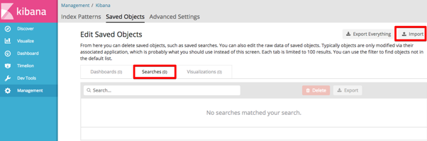

---

copyright:
years: 2017, 2018
lastupdated: "2018-07-25"

---

{:shortdesc: .shortdesc}
{:new_window: target="_blank"}
{:tip: .tip}
{:pre: .pre}
{:codeblock: .codeblock}
{:screen: .screen}
{:javascript: .ph data-hd-programlang='javascript'}
{:java: .ph data-hd-programlang='java'}
{:python: .ph data-hd-programlang='python'}
{:swift: .ph data-hd-programlang='swift'}

# 使用日志记录
{: #logging}

## 导入日志记录仪表板

要将 {{site.data.keyword.cnc_short}} 的日志记录仪表板导入到 IBM Cloud Private 中，请执行以下步骤。

  1. 确保已抽取并生成了日志记录仪表板，如[步骤 1：下载、解压缩和呈现仪表板模板](/docs/services/compare-and-comply/monitor.html#monitor)中所述。

  1. 登录到 IBM Cloud Private 集群。

  1. 从左上角的“菜单”图标中，选择**平台 -> 日志记录**。 
      
    

  1. 单击 Kibana 界面左侧的**管理**。 
    

  1. 选择**已保存的对象**选项卡。
    

  1. 选择**搜索**选项卡，然后单击**导入**。
    

  1. 分别导入在先前过程的步骤 6 中生成的 `frontend-logging.json` 和 `external-process-logging.json` 文件。出现提示时，单击**是，全部覆盖**。
     

  1. 仪表板将显示在**搜索**选项卡中。
     

## 查看日志记录仪表板
{: #view}

要查看日志记录仪表板，请执行以下步骤。

  1. 导航至**发现**选项卡。

  1. 单击 Kibana 界面右上方附近的**打开**。

  1. 选择要查看的仪表板。有两个日志记录仪表板，分别用于服务日志和外部进程日志。
    

您可以轻松更改时间范围和自动刷新频率：
  

