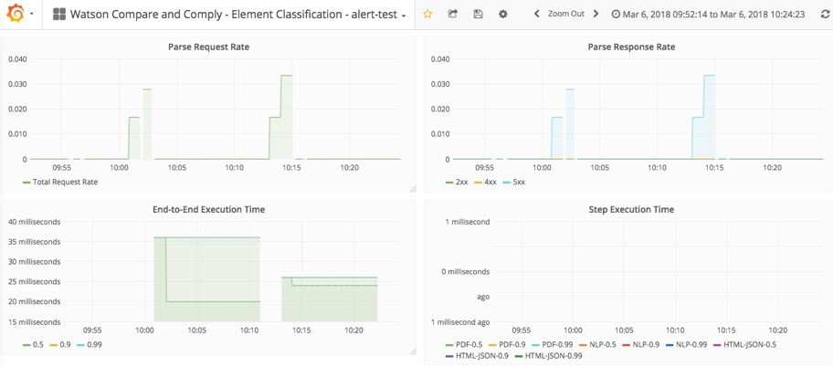

---

copyright:
  years: 2017, 2018
lastupdated: "2018-07-25"

---

{:shortdesc: .shortdesc}
{:new_window: target="_blank"}
{:tip: .tip}
{:pre: .pre}
{:codeblock: .codeblock}
{:screen: .screen}
{:javascript: .ph data-hd-programlang='javascript'}
{:java: .ph data-hd-programlang='java'}
{:python: .ph data-hd-programlang='python'}
{:swift: .ph data-hd-programlang='swift'}

# 使用度量值
{: #metrics}

您可以使用 IBM Cloud Private 的监视仪表板来监视 {{site.data.keyword.cnc_short}} 的状态。监视仪表板使用 Grafana（度量值）、Prometheus（警报）和 Kibana（日志记录）来提供有关 {{site.data.keyword.cnc_short}} 实例的详细信息。

## 导入度量值仪表板

要将 {{site.data.keyword.cnc_short}} 的度量值仪表板导入到 IBM Cloud Private 中，请执行以下步骤。

  1. 确保已抽取并生成了度量值仪表板，如[步骤 1：下载、解压缩和呈现仪表板模板](/docs/services/compare-and-comply/monitor.html#monitor)中所述。

  1. 登录到 IBM Cloud Private 集群。

  1. 从左上角的“菜单”图标中，选择**平台 -> 监视**。 
        
      

  1. 单击 Grafana 界面左上方附近的**主页**。 
      

  1. 单击**导入仪表板**。
      

  1. 选择先前过程的步骤 6 中生成的 `metrics.json` 文件，然后单击**上传 .json 文件**。 
      

  1. 选择 **Prometheus** 作为数据源，然后单击**导入**。
       

## 查看度量值仪表板
{: #view}

度量值仪表板类似于下图：

您可以轻松更改时间范围和自动刷新频率：

## 编辑度量值仪表板

可以通过执行以下步骤来编辑度量值仪表板或创建新的仪表板。

  1. 从左上角的“菜单”图标中，选择**平台 -> 监视**以访问 Grafana UI。

  1. 单击 Grafana 界面左上方附近的**主页**，然后单击 **+ 新建仪表板**。

  1. 选择要添加的面板的类型，例如**图形**或**表**。

  1. 单击面板标题，然后单击**编辑**。缺省面板标题为 `Panel title`。

  1. 使用**常规**选项卡来设置面板的标题、描述和维度。请注意，12 个单元即等于浏览器窗口全宽。

  1. 使用**度量值**选项卡来创建用于显示 Prometheus 中数据的查询。

    1. 如果您熟悉查询语言，那么可以直接编写查询，或者可以使用**度量值查找**字段从当前向 Prometheus 报告的度量值中进行选择。

    1. 查询的结果会实时显示在新的仪表板面板中。

    1. 可以将多个查询添加到一个面板。例如，可以在同一个图形上显示读写操作，或者在同一个表中显示访问总数和访问者总数。
        
