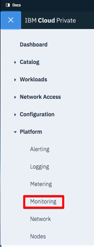

---

copyright:
  years: 2017, 2018
lastupdated: "2018-07-25"

---

{:shortdesc: .shortdesc}
{:new_window: target="_blank"}
{:tip: .tip}
{:pre: .pre}
{:codeblock: .codeblock}
{:screen: .screen}
{:javascript: .ph data-hd-programlang='javascript'}
{:java: .ph data-hd-programlang='java'}
{:python: .ph data-hd-programlang='python'}
{:swift: .ph data-hd-programlang='swift'}

# 使用度量
{: #metrics}

您可以使用 IBM Cloud Private 的監視儀表板，來監視 {{site.data.keyword.cnc_short}} 的狀態。監視儀表板會使用 Grafana（針對度量值）、Prometheus（針對警示）及 Kibana（針對記載），來呈現 {{site.data.keyword.cnc_short}} 實例的詳細資訊。

## 匯入度量儀表板

若要將 {{site.data.keyword.cnc_short}} 的度量儀表板匯入至 IBM Cloud Private，請執行下列步驟。

  1. 確定您已擷取並產生度量值儀表板，如[步驟 1：下載、擷取及呈現儀表板範本](/docs/services/compare-and-comply/monitor.html#monitor)中所述。

  1. 登入 IBM Cloud Private 叢集。

  1. 從左上角的「功能表」圖示中，選取**平台 -> 監視**。 
        
      

  1. 按一下 Grafana 介面左上方附近的**首頁**。 
      

  1. 按一下**匯入儀表板**。
      

  1. 選取在上述程序的「步驟 6」中產生的 `metrics.json` 檔案，然後按一下**上傳 .json 檔案**。 
      

  1. 選取 **Prometheus** 作為資料來源，然後按一下**匯入**。
       

## 檢視度量儀表板
{: #view}

度量儀表板類似下圖：

您可以輕鬆地變更時間範圍及自動重新整理的頻率：
  

## 編輯度量儀表板

您可以執行下列步驟，來編輯度量儀表板或建立新的儀表板。

  1. 從左上角的「功能表」圖示中，選取**平台 -> 監視**來存取 Grafana 使用者介面。

  1. 按一下 Grafana 介面左上方附近的**首頁**，然後按一下 **+ 新建儀表板**。

  1. 選取您要新增的畫面類型，例如**圖形**或**表格**。

  1. 按一下畫面標題，然後按一下**編輯**。預設畫面標題為 `Panel title`。

  1. 使用**一般**標籤，來設定畫面的標題、說明及維度。請注意，瀏覽器視窗的整個寬度是 12 個單位。

  1. 使用**度量**標籤來建立查詢，以顯示來自 Prometheus 的資料。

    1. 如果您熟悉查詢語言，則可以直接撰寫查詢，或者您可以使用**度量查閱**欄位，來選擇目前報告給 Promethus 的度量。

    1. 查詢的結果會即時顯示在新的儀表板畫面中。

    1. 可以將多個查詢新增至單一畫面。例如，您可以在相同圖形上顯示讀取和寫入作業，或在相同表格中顯示總造訪次數及訪客總數。
        
