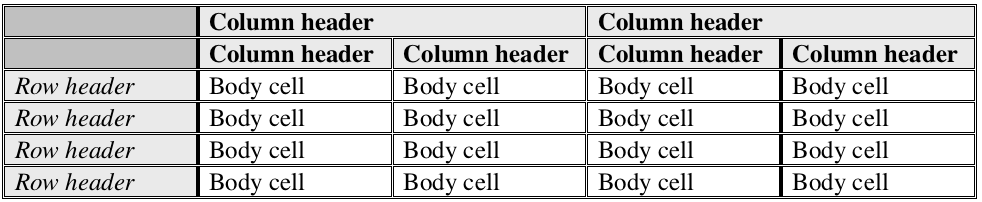

---

copyright:
years: 2018
lastupdated: "2018-08-02"

---

{:shortdesc: .shortdesc}
{:new_window: target="_blank"}
{:tip: .tip}
{:pre: .pre}
{:codeblock: .codeblock}
{:screen: .screen}
{:javascript: .ph data-hd-programlang='javascript'}
{:java: .ph data-hd-programlang='java'}
{:python: .ph data-hd-programlang='python'}
{:swift: .ph data-hd-programlang='swift'}

# Understanding table parsing
{: #understanding_tables}

After a document has been enriched by the service, the enriched document contains a `tables` array. Each object in the array describes a table identified in the input document by the service. See [Understanding the output schema](/docs/services/compare-and-comply/schema.html#output_schema) for information about the table parsing format.

The following is an example table from an input document.
 

The table is composed as follows:
 
 
where:

<ul>
  <li><strong><em>Bold italic text</em></strong> indicates a table header</li>
  <li><strong>Bold text</strong> indicates a column header</li>
  <li><em>Italic text</em> indicates a row header</li>
  <li>Unstyled text indicates a body cell</li>
</ul>
  
The output from service represents the example's first body cell (that is, the first cell in row 3 with a value of `35.0%`) as follows.

```
"tables": [ {
    "table": {
      "begin": 872,
      "end": 5879
    },
    "table_text": "...",
    "row_headers": [ {
      "id": "rowHeader-2244-2262",
      "cell": {
        "begin": 2244,
        "end": 2263
      },
      "cell_text": "Statutory tax rate",
      "row_index_min": 2,
      "row_index_max": 2,
      "column_index_min": 0,
      "column_index_max": 0
    },
    ... 
    ],
    "column_headers": [ {
      "id": "colHeader-1050-1082",
      "cell": {
        "begin": 1050,
        "end": 1083
      },
      "cell_text": "Three months ended September 30,",
      "row_index_min": 0,
      "row_index_max": 0,
      "column_index_min": 1,
      "column_index_max": 2
      }, {
      "id": "colHeader-1544-1548",
      "cell": {
        "begin": 1544,
        "end": 1549
      },
      "cell_text": "2005",
      "row_index_min": 1,
      "row_index_max": 1,
      "column_index_min": 1,
      "column_index_max": 1
    },
    ...
    ],
    "body_cells": [ {
      "id": "bodyCell-2450-2455",
      "cell": {
        "begin": 2450,
        "end": 2456
      },
      "cell_text": "35.0%",
      "row_index_min": 2,
      "row_index_max": 2,
      "column_index_min": 1,
      "column_index_max": 1,
      "row_header_ids": [ "rowHeader-2244-2262"],
      "row_header_texts": [ "Statutory tax rate"],
      "column_header_ids": [ "colHeader-1050-1082", "colHeader-1544-1548"],
      "column_header_texts": [ "Three months ended September 30,", "2005"]
      },
    ...
    ],
      "section_title": { },
      "section_title_text": "",
      "table_headers" : [ ]
    } 
]
```
    